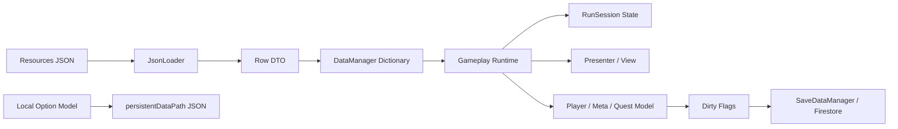
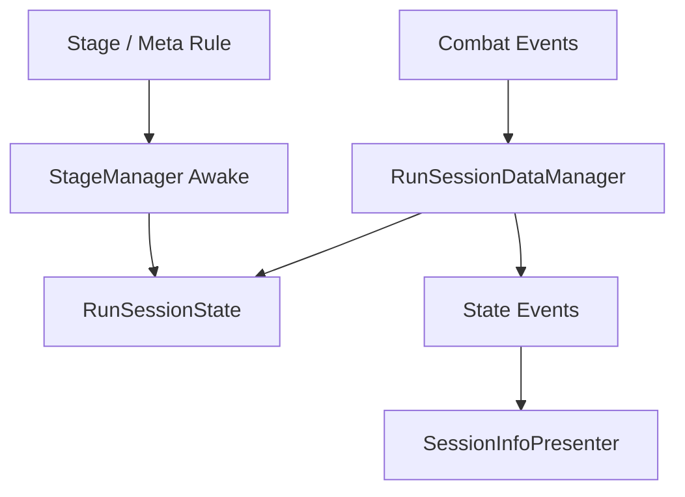
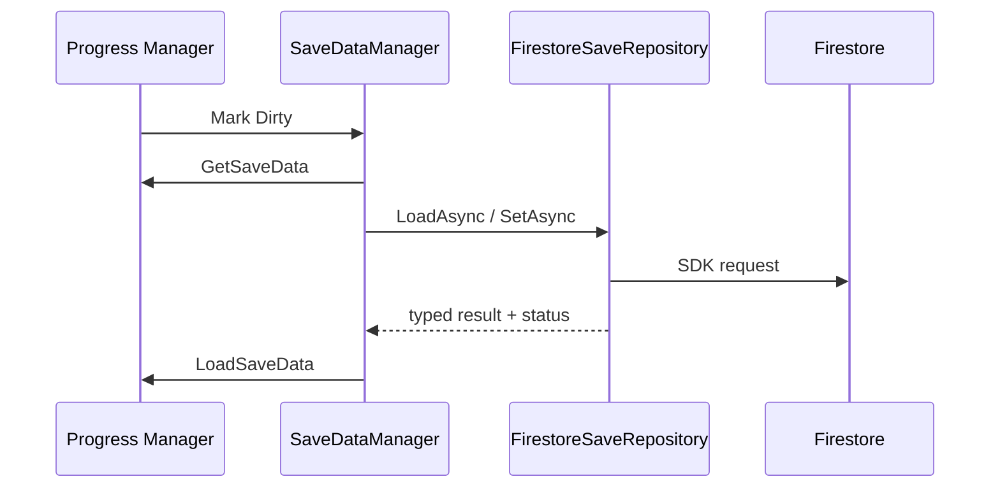

# 데이터 흐름

## 1. 문서 목적

정적 콘텐츠 JSON, 스테이지 세션 상태, 계정 영구 진행 데이터가 로드·변환·소비·저장되는 경로를 정의한다.

## 2. 데이터 분류

| 분류 | 예시 | 수명 | 저장 위치 |
|---|---|---|---|
| 정적 콘텐츠 | 타워, 적, 아이템, 웨이브, 스킬, 강화 규칙 | 애플리케이션 | Assets/Resources/Data JSON |
| 런 세션 | 골드, 생명, 레벨, 웨이브, 킬 수 | 스테이지 | 메모리 |
| 영구 진행 | 연구 레벨, 메타 재화, 타워/공용 강화, 업적 | 계정 | Firebase Firestore |
| 로컬 옵션 | 키 설정, 사운드, 그래픽, 언어 | 설치 환경 | Application.persistentDataPath JSON |

## 3. 전체 데이터 흐름



## 4. 정적 데이터 로딩

JsonLoader가 TextAsset을 역직렬화하고 각 DataManager가 문자열·숫자 필드를 enum과 런타임 타입으로 변환한다.

```csharp
TextAsset textAsset = ResourceCache.Load<TextAsset>(resourcePath);
T data = JsonUtility.FromJson<T>(textAsset.text);
```

| 데이터 | 행 수 |
|---|---:|
| TowerData | 36 |
| EnemyData | 26 |
| EnemySkillData | 13 |
| ItemData | 21 |
| WaveData | 240 |
| WaveEnemyRosterData | 424 |
| MetaResearchUpgradeData | 76 |
| Localization | 196 |

UID 기반 데이터는 Dictionary에 저장한다. 하나의 웨이브 UID에 여러 행이 매핑되는 로스터는 List로 반환한다.

## 5. 스테이지 데이터 흐름



RunSessionState는 값을 보관하고 RunSessionDataManager가 유효성 검사와 이벤트 발생을 담당한다. 골드는 음수 잔액을 허용하지 않으며 성공한 변경만 이벤트를 발행한다.

## 6. 영구 진행 데이터 흐름

- PlayerProgressManager: 연구 레벨, 경험치, 메타 재화
- TowerMetaUpgradeManager: 종족·등급별 공격력/공격속도 강화
- PublicMetaUpgradeManager: 시작 골드, 드랍 골드, 무료 장애물, 지형 갱신
- QuestManager: 진행 중·완료 업적과 성공 횟수

```text
Percent: current = base × (1 + valuePerLevel × level)
Flat:    current = base + valuePerLevel × level
Cost:    cost = ceil(costBase × costGrow^level)
```

전투 타워 최종 스탯은 메타 강화 결과에 런 강화, 아이템 강화, 종족 스킬 단계를 합산한다.

## 7. 저장 데이터 흐름



원격 저장은 PlayerProgress, MetaUpgrade, Quest 문서로 분리한다. 로컬 옵션은 temp 작성 → 기존 파일 backup → 본 파일 교체 순서로 저장한다.

## 8. 데이터 검증

- IValidSaveData로 Firestore 역직렬화 결과를 검증한다.
- enum 범위, 레벨·재화 음수 여부, 컬렉션 null 여부를 확인한다.
- StageWaveManager는 웨이브 시작 전에 적 UID, 스킬 UID, 레벨, 수량, 시간 값을 검증한다.
- 신규 사용자 또는 문서 누락은 기본 데이터를 생성한 뒤 Firestore에 기록한다.
- 현재 데이터에서 타워·적·웨이브 UID 중복과 끊어진 웨이브/로스터 참조는 확인되지 않았다.

## 9. 사용한 디자인

- DTO: JSON 과 Firestore 저장 모델
- Repository: Firebase SDK 오류를 FireStoreLoadResult로 변환
- Dirty Flag: 변경된 저장 영역만 기록
- Single Source of Truth: 세션 상태는 RunSessionState, 필드 타워는 FieldTowerManager가 소유

## 10. 성능 고려 사항

- 정적 데이터는 시작 시 한 번 파싱하고 재사용한다.
- ResourceCache가 Resources 조회 결과를 캐시한다.
- Dictionary 조회로 반복적인 선형 탐색을 줄인다.
- Firebase 문서를 관심사별로 나누어 불필요한 전체 문서 쓰기를 줄였다.
- LoadAllData는 세 문서를 순차 로드하므로 Task.WhenAll 병렬화가 가능하다.
- 일부 매니저의 List.Find는 데이터 규모가 커지면 복합 키 Dictionary가 더 적합하다.

## 11. 개선 가능성

1. 저장 모델에 스키마 버전과 마이그레이션 정책을 추가한다.
2. JSON 로딩 실패를 원인 코드가 포함된 Result 타입으로 통일한다.
3. 콘텐츠 빌드 전에 UID·참조·enum 문자열을 검사하는 검증기를 CI와 연결한다.
4. Firestore 저장을 재시도 큐와 지수 백오프로 보강한다.
5. 로컬 저장 복원 시 backup 자동 복구 경로를 추가한다.
6. 문자열 UID를 강타입 ID로 감싸 오타를 줄인다.
