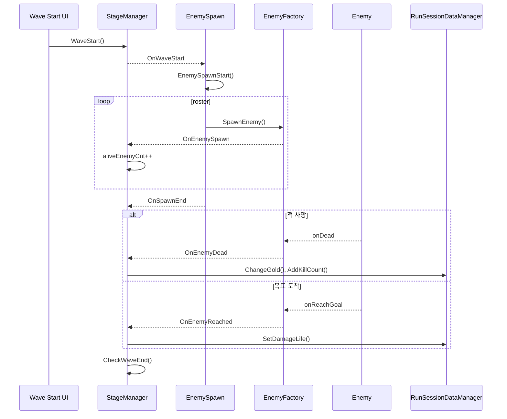
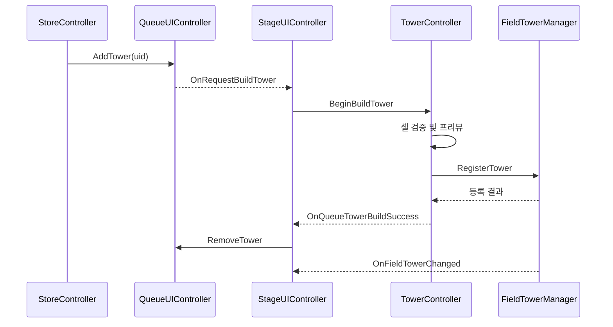
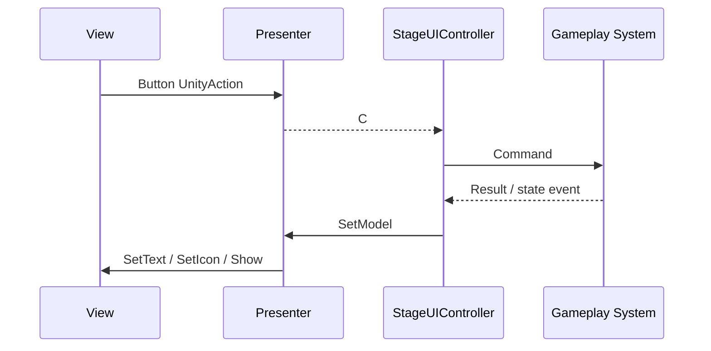
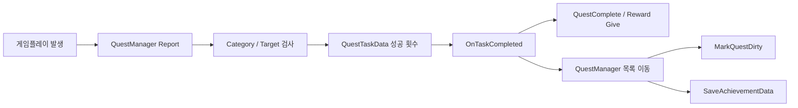

# 이벤트 흐름

## 1. 문서 목적

시스템 간 직접 호출을 줄이기 위해 사용한 C# 이벤트의 발행자, 구독자, 해제 시점과 주요 게임 흐름을 정의한다.

## 2. 기능 목적과 해결 대상

적 생성·사망·도착, 타워 설치·강화, 골드·경험치 변경은 동시에 UI와 퀘스트에 영향을 준다. 각 객체가 모든 소비자를 직접 알게 하면 순환 참조가 생기므로, 상태 소유자는 이벤트를 발행하고 조정자가 후속 동작을 연결한다.

## 3. 이벤트 설계 원칙

- 상태를 변경한 객체가 변경 이벤트를 발행한다.
- 게임 규칙 연결은 StageManager, UI 입력 연결은 StageUIController가 담당한다.
- OnDestroy에서 대칭적으로 구독을 해제한다.
- 성공 여부가 필요한 거래는 Func, 단순 통지는 Action을 사용한다.
- 변경 값을 이벤트 인자로 전달하여 구독자의 추가 탐색을 줄인다.

## 4. 주요 발행자와 구독자

| 발행자 | 이벤트 | 주요 구독자 | 결과 |
|---|---|---|---|
| EnemyFactory | OnEnemySpawn, OnEnemyDead, OnEnemyReached | StageManager | 생존 적 수, 골드, 생명 갱신 |
| EnemySpawn | OnSpawnEnd | StageManager | 웨이브 종료 가능 여부 검사 |
| RunSessionDataManager | 골드·EXP·레벨·생명·웨이브 이벤트 | Presenter, 퀘스트 브리지 | 화면과 진행 상태 갱신 |
| FieldTowerManager | OnFieldTowerChanged | 스킬·업적 처리 | 종족별 타워 수 기반 효과 재계산 |
| QueueUIController | OnRequestBuildTower | TowerController | 설치 모드 진입 |
| TowerController | 선택·설치·강화 이벤트 | StageUIController, StageManager | UI 전환, 큐 제거, 업적 보고 |
| Quest | OnQuestComplete | QuestManager | 목록 이동, 보상, 저장 |
| Presenter | 버튼 입력 이벤트 | StageUIController | 게임 시스템 명령 전달 |

## 5. 웨이브 이벤트 흐름



웨이브 종료는 **스폰 종료**와 **생존 적 0명**을 모두 만족해야 한다. isSpawning과 aliveEnemyCnt로 두 비동기 조건을 합성한다.

## 6. 타워 구매·설치 이벤트 흐름



대기열은 설치를 요청할 뿐 필드 상태를 변경하지 않는다. 필드 점유 상태의 단일 소유자는 FieldTowerManager다.

## 7. UI Presenter 흐름



View는 표시와 Unity UI 이벤트만 담당하고 Presenter가 모델을 표시 값으로 변환한다.

## 8. 퀘스트 이벤트 흐름



활성 목록을 복사한 뒤 순회하여 완료 처리 중 원본 목록이 변경되어도 열거 예외가 발생하지 않도록 했다.

## 9. 생명주기 관리

StageManager와 StageUIController는 Bind와 UnBind 메서드를 대칭으로 둔다. 이는 씬 재진입 시 중복 콜백과 파괴된 View 호출을 방지한다.

- 람다 구독은 동일 델리게이트로 해제하기 어렵기 때문에 명명 메서드를 우선한다.
- Quest는 완료 후 OnQuestComplete 참조를 정리한다.
- Presenter 해제 메서드는 모델 초기화 실패 경로에 대한 null 방어가 추가로 필요하다.

## 10. 핵심 코드

```csharp
private bool CanCompleteWave()
{
    if (isSpawning) return false;
    if (aliveEnemyCnt > 0) return false;
    if (sessionManager.SessionState.CurrentLife <= 0)
    {
        UserDead();
        return false;
    }
    return !isGameOver;
}
```

이벤트 도착 순서와 무관하게 같은 종료 검사를 호출해 상태를 수렴시킨다.

## 11. 성능 고려 사항

- 이벤트는 상태 변화 시에만 UI를 갱신하므로 Update 폴링보다 비용이 낮다.
- 값 인자를 전달해 구독자의 추가 조회를 줄였다.
- 퀘스트 보고마다 활성 목록을 복사하므로 퀘스트 수가 커지면 할당이 발생한다.
- C# 이벤트 실행 순서는 계약되지 않으므로 순서 의존 로직은 조정자 메서드 안에서 직접 호출해야 한다.

## 12. 개선 가능성

- 이벤트를 도메인별 채널로 분류하고 중앙 로깅을 추가한다.
- 구독 토큰 또는 IDisposable을 적용해 해제 누락을 구조적으로 방지한다.
- 퀘스트를 카테고리별로 인덱싱해 모든 활성 퀘스트 순회를 줄인다.
- 자동화 테스트로 이벤트의 정확히 한 번 발생 계약을 검증한다.
