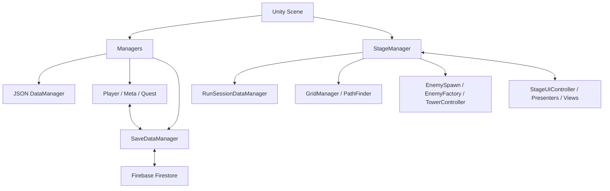

# RandomTowerDefence Case Study

## 1. 프로젝트 배경

RandomTowerDefence는 Unity 6 기반 2D 타워 디펜스 프로젝트다. 현재 기능 개발은 종료했으며 포트폴리오 문서화 단계에 있다.

게임 흐름은 상점 구매, 타워 대기열, 그리드 배치, 웨이브 전투, 런 강화, 결과 보상, 계정 메타 성장으로 이어진다. 이를 지원하기 위해 전역 서비스, 스테이지 런타임, 정적 데이터, UI, 저장 기능을 분리하고 C# 이벤트로 연결했다.

현재 데이터에서 확인되는 구성은 다음과 같다.

- 타워 36행: 6종족 × 6등급
- 적 26행, 적 스킬 13행
- 웨이브 240행, 적 로스터 424행
- 아이템 21행
- 메타 강화 76행
- 현지화 196행

## 2. 개발 범위와 제약

### 확인 가능한 구현 범위

- Managers를 통한 전역 서비스와 데이터 매니저 초기화
- StageManager를 통한 스테이지 범위 시스템 조립과 이벤트 연결
- 타워 건설, 선택, 이동, 교환, 판매, 등급 합성
- FieldTowerManager의 셀 점유와 종족별 타워 수 관리
- StoreController와 QueueUIController를 이용한 구매·보관·설치 요청
- JSON 기반 웨이브 검증과 EnemyFactory 기반 적 생성
- GridManager와 PathFinder를 이용한 적 이동 경로 계산
- 런 스탯 강화와 계정 메타 성장 계산
- Firebase Authentication·Firestore 및 로컬 JSON 저장
- ScriptableObject 기반 퀘스트·업적
- Presenter/View 기반 스테이지 UI와 정보 패널 전환

### 개발 정보와 검증 제약

| 항목 | 상태 |
|---|---|
| 개발 기간 | 2026.04.13 ~ 2026.06.26 |
| 개발 인원 | 1인 개발 |
| 대상 플랫폼 | Steam |
| 개인 담당 범위 | 전체 프로그래밍, 시스템 설계, UI 구현, 데이터 구조 설계, 저장·로드 구현, 기술 문서 작성 |
| 기여율 | 1인 개발 기준 전체 구현 담당 |
| 플레이 성능 | 측정 자료가 없어 수치 기재 제외 |

프로젝트에는 자동화 테스트 파일이 확인되지 않았다. 따라서 이 문서의 결과는 현재 코드, 데이터, 이벤트 연결과 작성된 기술 문서를 기준으로 정리한다.

## 3. 핵심 문제 정의

### 문제 1. 구매와 배치 시점의 분리

상점에서 타워를 구매하는 시점과 필드에 배치하는 시점이 다르다. 구매 직후 GameObject를 생성하면 상점이 그리드와 배치 규칙까지 알아야 한다.

또한 골드가 차감됐지만 대기열에 상품이 들어가지 않은 상태, 설치에 실패했지만 대기열 타워가 제거된 상태, GameObject는 생성됐지만 필드 점유 데이터에는 등록되지 않은 상태를 방지해야 했다.

### 문제 2. 웨이브 종료 조건의 결합

적 스폰 완료와 필드의 모든 적 제거는 서로 다른 시점에 발생한다. 스폰 완료만 검사하면 적이 남아 있어도 종료될 수 있고, 생존 적 수만 검사하면 아직 생성될 적이 있는데도 0으로 판단할 수 있다.

### 문제 3. 런 상태와 영구 진행 데이터의 분리

전투 중에만 유지되는 골드·생명·웨이브 상태와 계정에 유지되는 연구 레벨·메타 재화·업적은 수명주기와 저장 위치가 다르다. 저장 기능에서는 문서 없음, 네트워크 오류, 권한 오류, 시간 초과, 데이터 손상도 구분해야 했다.

## 4. 선택한 해결 전략

| 문제 | 선택한 구조 | 실제 처리 |
|---|---|---|
| 구매와 배치 분리 | StoreController → QueueUIController → TowerController → FieldTowerManager | 구매, UID 보관, 셀 검증·생성, 필드 등록을 단계별로 분리 |
| 웨이브 종료 조건 | StageWaveManager → EnemySpawn → EnemyFactory → StageManager | 준비 검증, 스폰, 적 생명주기 이벤트, 종료 판정을 분리 |
| 런·영구 상태 분리 | RunSessionDataManager / Player·Meta Manager / SaveDataManager | 스테이지 메모리 상태와 계정 진행 데이터를 별도 모델로 관리 |
| 원격 로드 실패 구분 | FirestoreSaveRepository + FireStoreLoadResult | Timeout, PermissionError, NetworkError, DataCorrupted 등을 상태로 반환 |
| UI와 게임 로직 분리 | StageUIController + Presenter/View | View 표시, Presenter 변환, Controller 이벤트 연결로 책임 구분 |

이 구조는 모든 의존성을 제거하기보다 상태 소유자와 조정자를 구분하는 방향으로 구성되어 있다. Managers와 StageManager에 의존성이 집중되는 트레이드오프도 남아 있다.

## 5. 시스템 설계

### 주요 조정 지점

- **Managers**: 씬 전환 후에도 유지되는 전역 서비스 접근점이다.
- **StageManager**: Grid, PathFinder, RunSessionDataManager, FieldTowerManager 등 스테이지 수명의 객체를 생성하고 이벤트를 연결한다.
- **StageUIController**: Queue, TowerController, Presenter, 정보 패널, 게임 시스템 사이의 UI 이벤트를 바인딩하고 해제한다.
- **DataManager 계층**: Resources JSON Row를 enum과 런타임 모델로 변환하고 UID 기반 조회를 제공한다.
- **SaveDataManager**: 로컬 옵션과 Firestore 진행 데이터의 저장 정책을 관리한다.
- **FirestoreSaveRepository**: Firestore 로드 요청을 타입화된 결과로 변환하고 IValidSaveData 검증을 호출한다.

세부 구조는 [SystemArchitecture](../Architecture/SystemArchitecture.md), [EventFlow](../Architecture/EventFlow.md), [DataFlow](../Architecture/DataFlow.md)에서 확인할 수 있다.

## 6. 대표 구현 사례

### 사례 1. 타워 구매와 건설 흐름 분리

**상황**

상점에서 구매한 타워는 플레이어가 위치를 선택할 때까지 대기열에 남아야 했다.

**문제**

구매 실패, 설치 실패, 필드 등록 실패가 각각 다른 시점에 발생한다. 단계별로 골드, 큐, GameObject, 필드 점유 상태를 다르게 처리해야 했다.

**해결**

1. StoreController가 StageManager.UsingGold를 통해 가격을 차감한다.
2. QueueUIController.AddTower가 실패하면 StoreController가 가격을 환불한다.
3. QueueUIController.OnRequestBuildTower가 TowerController.BeginBuildTower에 연결된다.
4. TowerController가 셀 범위, 시작·도착점, 장애물, 기존 타워, 최대 설치 수를 검사한다.
5. Tower를 생성하고 FieldTowerManager.RegisterTower를 호출한다.
6. 등록 성공 시에만 OnQueueTowerBuildSuccess를 발생시킨다.
7. StageUIController가 이 이벤트를 QueueUIController.RemoveTower에 연결한다.

**결과**

구매 수용 실패 시 골드가 복구되고, 필드 설치 실패 시 대기열 타워는 유지된다. FieldTowerManager 등록 실패 시 생성한 GameObject는 제거된다.

### 사례 2. 웨이브 종료 조건 처리

**상황**

EnemySpawn의 스폰 코루틴 종료와 필드 적의 사망·도착은 서로 다른 이벤트로 전달된다.

**문제**

한 이벤트만으로 웨이브 완료를 판정하면 아직 적이 남아 있거나 생성 예정인 상태를 완료로 처리할 수 있다.

**해결**

- EnemyFactory.OnEnemySpawn에서 aliveEnemyCnt를 증가시킨다.
- OnEnemyDead와 OnEnemyReached에서 aliveEnemyCnt를 감소시킨다.
- EnemySpawn.OnSpawnEnd에서 isSpawning을 false로 변경한다.
- 각 종료 가능 지점에서 StageManager.CheckWaveEnd를 호출한다.
- CanCompleteWave가 isSpawning, aliveEnemyCnt, 현재 생명, 게임 종료 상태를 함께 검사한다.

**결과**

스폰이 끝나고 생존 적이 0명인 경우에만 다음 웨이브 준비 또는 스테이지 종료 흐름으로 이동한다.

### 사례 3. 저장 실패와 데이터 검증

**상황**

계정 진행 데이터는 Firebase Firestore에서 불러오고, 입력·사운드·그래픽 옵션은 로컬 JSON으로 관리한다.

**문제**

Firestore 문서 없음과 실제 오류를 같은 실패로 처리하면 신규 사용자 초기화와 장애 처리를 구분하기 어렵다. 역직렬화 성공 후에도 값 검증이 필요했다.

**해결**

- FireStoreLoadResult가 Success, DocumentMissing, NetworkError, DataCorrupted, Timeout, PermissionError, UnknownError를 구분한다.
- Task.WhenAny로 기본 10초 제한 시간을 적용한다.
- IValidSaveData로 enum 범위, 음수 값, null 컬렉션을 검사한다.
- DocumentMissing이면 기본 데이터를 생성하고 Firestore에 기록한다.
- Player, Meta, Quest 저장 영역에 별도 dirty flag를 사용한다.
- 로컬 옵션은 temp 작성, 기존 파일 backup, 본 파일 교체 순서로 저장한다.

**결과**

신규 사용자 초기화, 로드 실패 원인, 데이터 유효성 실패를 별도 경로로 처리한다. 변경되지 않은 원격 문서는 저장 대상에서 제외한다.

## 7. 문제 해결 과정

### 7.1 설치 성공을 연속된 검증으로 처리

TowerController.BuildTower는 UID 존재 여부와 배치 가능 여부를 먼저 검사한다. 이후 프리팹을 생성하고 Tower.Init과 TowerMove 설정을 수행한 뒤 FieldTowerManager에 등록한다.

필드 등록까지 성공해야 BuildTower가 true를 반환한다. TryBuildPendingTower는 이 반환값이 true일 때만 큐 제거 이벤트를 발생시킨다. 이 순서로 UI 선택 상태와 필드 점유 상태를 분리해 확인한다.

등급 합성은 여러 타워를 제거한 뒤 새 타워를 생성하므로 별도 복구 경로가 있다. TowerRestoreData에 재료 타워의 UID와 셀을 보관하고, 제거 또는 결과 생성이 실패하면 RestoreTowers를 호출한다. 복구 결과는 Success, PartialSuccess, Failed로 구분한다.

해당 처리 이전에 어떤 버그가 발생했는지와 재현 과정은 커밋 또는 이슈 자료에서 확인되지 않았다.

> TODO: 확인 필요 — 타워 건설·합성 복구 로직을 도입하게 된 실제 디버깅 사례

### 7.2 이벤트 도착 순서와 무관한 웨이브 판정

EnemySpawnEnd, RegisterDeadEnemy, RegisterReachedEnemy는 모두 마지막에 CheckWaveEnd를 호출한다. 특정 이벤트 하나가 완료 판정을 독점하지 않고 현재 상태를 다시 검사한다.

CanCompleteWave는 스폰 중 여부, 생존 적 수, 현재 생명, 게임 종료 상태를 순서대로 확인한다. 이벤트 호출 순서 자체보다 isSpawning과 aliveEnemyCnt의 현재값을 기준으로 판단한다.

현재 EnemySpawn은 적 그룹 하나의 스폰이 끝난 뒤 다음 그룹을 처리한다. 서로 겹치는 startTime 그룹이 의도된 것인지는 확인되지 않았다.

> TODO: 확인 필요 — 웨이브 로스터의 startTime 그룹이 동시에 스폰되어야 하는지 여부

## 8. 결과와 검증

현재 코드와 데이터의 정적 검토 기준으로 확인된 결과다.

- 구매, 대기열 보관, 필드 설치가 별도 단계로 분리되어 있다.
- 큐 제거는 FieldTowerManager 등록 성공 후 발생한다.
- 타워 합성 실패 시 재료 복구를 시도하는 경로가 있다.
- StageWaveManager가 웨이브 시작 전에 적·스킬 UID와 스폰 수치를 검증한다.
- 스폰 종료와 생존 적 수를 함께 사용해 웨이브 완료를 판정한다.
- C# 이벤트로 적 생명주기, 세션 상태, UI 입력, BuildTower·ClearStage 업적 보고가 연결된다.
- 런 상태는 RunSessionDataManager에, 계정 진행은 Player·Meta·Quest 모델에 분리되어 있다.
- 로컬 옵션과 Firestore 진행 데이터가 서로 다른 저장 경로를 사용한다.
- Architecture 3개, Systems 7개를 포함한 기술 문서 구조가 작성되어 있다.

성능 개선 효과를 입증할 프로파일러 수치와 자동화 테스트 결과는 현재 자료에서 확인되지 않았다.

## 9. 검증 범위와 후속 과제

이 문서는 현재 코드와 데이터의 정적 검토를 기준으로 구현 판단을 설명한다. 성능 수치, 자동화 테스트 결과, 실제 개발 당시의 디버깅 기록은 확인된 자료가 있는 범위에서만 다뤘다.

- Enemy·Tower 생성, A* 경로 계산, TowerAttack 범위 탐색의 실제 비용은 프로파일러 측정이 필요하다.
- StageManager와 TowerController의 조정 책임은 기능 증가 시 더 작은 흐름 객체로 분리할 수 있다.
- 저장 모델의 schemaVersion, 마이그레이션, 재시도 정책은 후속 설계가 필요하다.
- Resources 문자열 경로는 Addressables 또는 별도 데이터 파이프라인 도입 시 재검토할 수 있다.
- TODO: 확인 필요 — KillEnemy, CollectItem, UpgradeTower의 실제 QuestRecieveReport 연결 의도

기술적 부채와 다시 개발할 때의 우선순위는 [Postmortem](../Postmortem.md)에 정리했다.

## 10. 관련 자료

### 프로젝트 개요

- [ProjectSummary](ProjectSummary.md) — 구현 범위와 면접 포인트 요약
- [Postmortem](../Postmortem.md) — 잘된 점, 어려웠던 점, 기술적 부채와 개선 방향

### 아키텍처

- [SystemArchitecture](../Architecture/SystemArchitecture.md) — 전체 계층과 클래스 책임
- [EventFlow](../Architecture/EventFlow.md) — 시스템 이벤트의 발행·구독 흐름
- [DataFlow](../Architecture/DataFlow.md) — 정적 데이터, 런 상태, 저장 데이터 흐름

### 시스템

- [BuildSystem](../Systems/BuildSystem.md) — 타워 건설과 필드 점유
- [ShopAndQueueSystem](../Systems/ShopAndQueueSystem.md) — 구매, 환불, 대기열, 설치 요청
- [WaveAndEnemySystem](../Systems/WaveAndEnemySystem.md) — 웨이브 검증, 적 생성, 종료 판정
- [MetaUpgradeSystem](../Systems/MetaUpgradeSystem.md) — 메타 성장과 스탯 계산
- [SaveLoadSystem](../Systems/SaveLoadSystem.md) — 로컬·Firestore 저장과 검증
- [QuestSystem](../Systems/QuestSystem.md) — 퀘스트·업적 진행과 저장
- [UIInfoPanelSystem](../Systems/UIInfoPanelSystem.md) — Presenter/View와 정보 패널 전환
- [EditorTooling](../Systems/EditorTooling.md) — 데이터 제작·검증과 Play Mode 디버깅 도구
