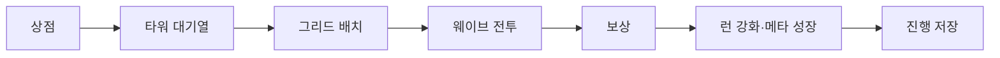

# RandomTowerDefence 프로젝트 요약

> Unity 6 기반 2D 타워 디펜스 프로젝트의 구현 범위와 기술적 판단을 빠르게 확인하기 위한 요약 문서입니다.

## 1. 프로젝트 카드

| 항목 | 내용 |
|---|---|
| 개발 기간 | 2026.04.13 ~ 2026.06.26 |
| 개발 형태 | 1인 개발 |
| 대상 플랫폼 | Steam |
| 개발 상태 | 기능 개발 종료, 포트폴리오 문서화 단계 |
| 담당 범위 | 전체 프로그래밍, 시스템·UI·데이터 구조 설계, 저장·로드, Editor Tooling, 기술 문서 작성 |
| 주요 기술 | Unity 6, C#, Firebase Authentication·Firestore, JSON Data, DOTween, Unity UI |

## 2. 핵심 게임 흐름

구매, 보관, 배치, 전투, 성장, 저장의 상태 소유자를 분리하고 이벤트 또는 명시적 반환값으로 결과를 전달합니다.

## 3. 핵심 구현 시스템

| 시스템 | 핵심 판단 | 상세 문서 |
|---|---|---|
| 타워 건설 | 생성보다 필드 등록 성공을 설치 완료 기준으로 사용 | [BuildSystem](../Systems/BuildSystem.md) |
| 상점·대기열 | 구매와 배치를 분리하고 대기열 수용 실패 시 환불 | [ShopAndQueueSystem](../Systems/ShopAndQueueSystem.md) |
| 웨이브·적 | 스폰 상태와 생존 적 수를 함께 사용해 종료 판정 | [WaveAndEnemySystem](../Systems/WaveAndEnemySystem.md) |
| 메타 성장 | 기본값, 영구 강화, 런 강화를 단계별로 합성 | [MetaUpgradeSystem](../Systems/MetaUpgradeSystem.md) |
| 저장·불러오기 | 로컬 옵션과 계정 진행 분리, 오류 상태와 모델 유효성 검사 | [SaveLoadSystem](../Systems/SaveLoadSystem.md) |
| 퀘스트·업적 | 원본 ScriptableObject와 런타임 진행 상태 분리 | [QuestSystem](../Systems/QuestSystem.md) |
| UI 정보 패널 | Presenter, View, StageUIController의 표시·입력·조정 책임 분리 | [UIInfoPanelSystem](../Systems/UIInfoPanelSystem.md) |
| Editor Tooling | 데이터 편집·검증, 퀘스트 제작, Play Mode 디버깅 도구화 | [EditorTooling](../Systems/EditorTooling.md) |

## 4. 설계 키워드

- **Data-Driven:** 타워, 적, 아이템, 웨이브, 강화 규칙을 Resources JSON에서 로드
- **Observer:** C# 이벤트로 전투, 세션, UI, 퀘스트 상태 전달
- **Factory:** EnemyFactory가 적 생성과 필수 컴포넌트 초기화 담당
- **Repository:** FirestoreSaveRepository가 Firebase 결과와 오류 상태 변환
- **Presenter/View:** 표시 값 변환과 Unity UI 조작 분리
- **Dirty Flag:** 변경된 원격 저장 영역만 기록
- **Editor Extension:** EditorWindow, CustomEditor, CustomPropertyDrawer로 제작·검증 보조

## 5. 상세 문서

- [Case Study](CaseStudy.md) — 문제 정의, 설계 전략, 구현 사례
- [System Architecture](../Architecture/SystemArchitecture.md) — 시스템 계층과 조정 관계
- [Postmortem](../Postmortem.md) — 회고, 기술적 한계, 개선 방향
