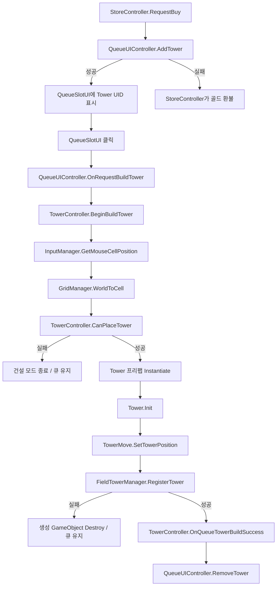
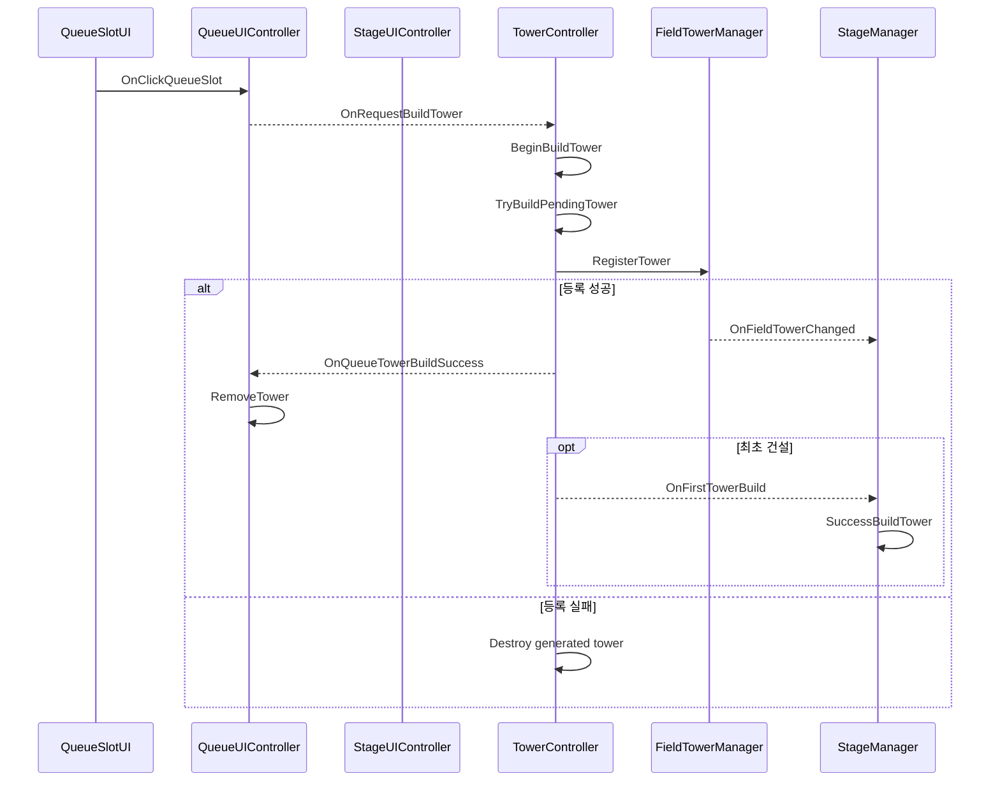

# 타워 건설 시스템

## 1. 개요

타워 건설 시스템은 상점에서 구매한 타워를 대기열에 보관한 뒤, 플레이어가 선택한 그리드 셀에 배치하는 흐름을 담당한다.

실제 건설 처리는 [TowerController](../../Assets/02.Scripts/Tower/TowerController.cs)가 조정한다. 마우스 위치를 셀 좌표로 변환하고, 해당 셀의 사용 가능 여부를 검사한 뒤 타워 프리팹을 생성한다. 생성된 타워의 필드 점유 상태는 [FieldTowerManager](../../Assets/02.Scripts/Managers/Stage/FieldTowerManager.cs)에 등록한다.

건설 외에도 같은 Controller에서 타워 선택, 이동, 위치 교환, 판매, 등급 업그레이드를 처리한다. 본 문서는 이 가운데 상점·대기열에서 시작되는 타워 건설 흐름을 중심으로 정리한다.

## 2. 구현 목적

상점에서 타워를 구매하는 시점과 필드에 배치하는 시점은 일치하지 않는다. 구매한 타워를 즉시 생성하지 않고 대기열에 보관함으로써 플레이어가 배치 위치를 선택할 수 있도록 했다.

별도의 건설 흐름이 필요한 이유는 다음과 같다.

- 상점은 상품 구매와 골드 처리만 담당해야 한다.
- 대기열은 구매한 타워의 UID와 슬롯 위치를 유지해야 한다.
- 마우스 입력은 월드 좌표를 그리드 셀로 변환해야 한다.
- 설치 전에 그리드 범위, 시작점·도착점, 장애물, 기존 타워, 최대 타워 수를 검사해야 한다.
- GameObject 생성 성공과 필드 점유 정보 등록 성공을 함께 확인해야 한다.
- 실제 설치가 성공한 경우에만 대기열 슬롯을 비워야 한다.

## 3. 해결하려던 문제

코드에서 확인되는 연결 대상은 다음과 같다.

1. [StoreController](../../Assets/02.Scripts/UI/Controllers/Stage/StoreController.cs)가 상품 가격을 차감한다.
2. 타워 상품이면 QueueUIController.AddTower로 타워 UID를 대기열에 추가한다.
3. 플레이어가 QueueSlotUI를 선택하면 QueueUIController가 설치 요청 이벤트를 발생시킨다.
4. TowerController가 설치 모드에 진입하고 마우스 위치를 셀 좌표로 계산한다.
5. GridManager, ObstacleBuilder, FieldTowerManager, RunSessionDataManager를 이용해 설치 가능 여부를 검사한다.
6. 검사를 통과하면 타워를 생성하고 필드에 등록한다.
7. 등록에 성공한 경우에만 원래 대기열 슬롯을 제거한다.

이 흐름이 분리되지 않으면 상점 UI가 그리드와 프리팹 생성까지 알아야 하거나, 설치 실패에도 대기열의 타워가 사라지는 문제가 생길 수 있다. 현재 구현은 구매, 보관, 배치, 필드 등록을 서로 다른 클래스가 담당하도록 나누고 이벤트로 연결한다.

## 4. 주요 클래스

| 클래스 | 실제 책임 |
|---|---|
| [StoreController](../../Assets/02.Scripts/UI/Controllers/Stage/StoreController.cs) | 타워 상품 구매 시 골드를 차감하고 QueueUIController.AddTower를 호출한다. 큐 추가 실패 시 가격을 환불한다. |
| [QueueUIController](../../Assets/02.Scripts/UI/Controllers/Stage/QueueUIController.cs) | 슬롯별 타워 UID를 보관하고, 슬롯 선택 시 OnRequestBuildTower를 발생시킨다. |
| [QueueSlotUI](../../Assets/02.Scripts/UI/Queue/QueueSlotUI.cs) | 슬롯의 UID와 표시 상태를 관리하고 클릭을 QueueUIController에 전달한다. |
| [StageUIController](../../Assets/02.Scripts/UI/Controllers/Stage/StageUIController.cs) | QueueUIController와 TowerController의 이벤트를 연결하고 해제한다. |
| [TowerController](../../Assets/02.Scripts/Tower/TowerController.cs) | 설치 모드, 마우스 입력, 프리뷰, 검증, 타워 생성, 등록 결과를 조정한다. |
| [InputManager](../../Assets/02.Scripts/Managers/Core/InputManager.cs) | 마우스 스크린 좌표를 월드 좌표로 변환하고 GridManager를 통해 셀 좌표를 반환한다. |
| [GridManager](../../Assets/02.Scripts/Managers/Stage/GridManager.cs) | 그리드 크기와 원점, 셀 크기, 시작·도착 셀을 보관하고 월드/셀 좌표를 변환한다. |
| [ObstacleBuilder](../../Assets/02.Scripts/Stage/Builder/ObstacleBuilder.cs) | 셀별 장애물 배열을 보관하고 HasObstacle, GetObstacleCells를 제공한다. |
| [TowerBuildPreview](../../Assets/02.Scripts/Tower/TowerBuildPreview.cs) | 마우스 위치의 타워 스프라이트와 셀 중심 강조 표시를 갱신한다. |
| [FieldTowerManager](../../Assets/02.Scripts/Managers/Stage/FieldTowerManager.cs) | 셀별 타워 배열, 필드 타워 목록, 종족별 타워 수를 관리한다. |
| [TowerMove](../../Assets/02.Scripts/Tower/TowerMove.cs) | 셀 중심 월드 좌표로 Transform을 이동하고 현재 셀을 역산한다. |
| [Tower](../../Assets/02.Scripts/Tower/Tower.cs) | UID로 TowerData를 조회하여 종족, 등급, 가격, 스탯, 다음 등급 UID를 초기화한다. |
| [RunSessionDataManager](../../Assets/02.Scripts/Managers/Data/RunSessionDataManager.cs) | 현재 레벨 기준 최대 설치 가능 타워 수를 제공한다. |

## 5. 데이터 흐름



건설 실패 시 TryBuildPendingTower가 EndBuildMode를 호출하지만 OnQueueTowerBuildSuccess는 발생시키지 않는다. 따라서 선택한 큐 슬롯은 유지된다.

## 6. 이벤트 흐름

건설과 직접 관련해 코드에서 확인되는 이벤트는 다음과 같다.

| 이벤트 | 발생 위치 | 연결 위치 | 처리 |
|---|---|---|---|
| QueueUIController.OnRequestBuildTower | QueueUIController.OnClickQueueSlot | StageUIController.BindQueueUI | TowerController.BeginBuildTower 호출 |
| TowerController.OnQueueTowerBuildSuccess | TowerController.TryBuildPendingTower | StageUIController.BindQueueUI | QueueUIController.RemoveTower 호출 |
| TowerController.OnFirstTowerBuild | 첫 설치 성공 시 TryBuildPendingTower | TowerController.Start | StageManager.SuccessBuildTower 호출 |
| FieldTowerManager.OnFieldTowerChanged | RegisterTower, UnRegisterTower, MoveTower, RemoveTowers | StageManager.BindFieldEvents | TowerCntSkillInfoController.ChangeFieldTower와 StageManager.TowerSkillCountChanged 호출 |



StageUIController는 OnDestroy에서 두 큐 관련 이벤트 연결을 해제한다. OnFirstTowerBuild도 TowerController.OnDestroy에서 해제한다.

## 7. 핵심 구현 방식

### 7.1 마우스 위치를 셀 좌표로 변환

InputManager.GetMouseCellPosition은 카메라를 통해 마우스 월드 좌표를 구한 뒤 GridManager.WorldToCell을 호출한다.

```csharp
public Vector2Int GetMouseCellPosition(
    Camera camera, GridManager grid)
{
    Vector3 mouseWorld = GetMouseWorldPosition(camera);
    return grid.WorldToCell(mouseWorld);
}
```

GridManager는 맵 원점과 셀 크기를 이용해 셀 인덱스를 계산한다.

```csharp
int x = Mathf.FloorToInt(
    (worldPos.x - mapOrigin.x) / cellSize);
int y = Mathf.FloorToInt(
    (worldPos.y - mapOrigin.y) / cellSize);
```

### 7.2 설치 가능 여부 검사

TowerController.CanUseTowerCell과 CanPlaceTower가 조건을 단계적으로 검사한다.

- GridManager.IsInBounds: 그리드 범위 내부인지 확인
- IsBlockedCell: StageManager가 제공하는 시작 셀 또는 도착 셀인지 확인
- ObstacleBuilder.HasObstacle: 해당 셀에 장애물이 있는지 확인
- FieldTowerManager.HasTower: 기존 타워가 점유 중인지 확인
- RunSessionDataManager.GetMaxBuildTowerCount: 현재 레벨의 최대 타워 수를 초과하는지 확인

```csharp
private bool CanPlaceTower(Vector2Int cell)
{
    if (!CanUseTowerCell(cell))
        return false;

    if (HasTower(cell))
        return false;

    if (fieldTowerManager.GetTotalTowerCount()
        >= runSession.GetMaxBuildTowerCount())
        return false;

    return true;
}
```

일반 설치는 **장애물이 존재하는 셀**만 허용한다. 이 조건은 현재 코드에 명시되어 있다.

### 7.3 설치 프리뷰

건설 모드에서는 Update에서 현재 마우스 셀을 계산하고 TowerPreview를 호출한다. TowerBuildPreview는 타워 이미지는 마우스 월드 위치에, 셀 강조 이미지는 셀 중심에 배치한다. 가능 여부에 따라 초록색 또는 빨간색으로 표시한다.

마우스가 큐 UI 위에 있을 때의 설치 클릭은 InputManager.IsPointerOverUI<QueueUIController> 검사로 중단한다.

### 7.4 타워 생성과 등록

TowerController.BuildTower의 처리 순서는 다음과 같다.

1. UID가 비어 있지 않은지 확인한다.
2. TowerDataManager에서 UID가 존재하는지 확인한다.
3. CanPlaceTower를 호출한다.
4. GridManager.CellToWorldCenter로 생성 위치를 구한다.
5. towerPre를 Instantiate한다.
6. Tower 컴포넌트를 확인하고 Tower.Init을 호출한다.
7. TowerMove를 가져오거나 추가한 뒤 StageManager의 Grid를 전달한다.
8. TowerMove.SetTowerPosition으로 셀 중심에 배치한다.
9. FieldTowerManager.RegisterTower로 점유 상태를 등록한다.
10. 등록 실패 시 생성한 GameObject를 파괴한다.

### 7.5 필드 점유 상태

FieldTowerManager는 다음 세 형태의 데이터를 함께 관리한다.

- Tower[,] towerMap: 셀 기준 조회
- List<Tower> fieldTowers: 전체 타워 순회
- Dictionary<TowerType, int> towerTypeCnt: 종족별 개수

RegisterTower는 셀과 중복 등록을 검사한 뒤 세 데이터를 갱신하고 OnFieldTowerChanged를 발생시킨다.

### 7.6 큐 갱신

TryBuildPendingTower는 BuildTower가 true를 반환한 경우에만 OnQueueTowerBuildSuccess(selectedQueueIndex)를 발생시킨다. StageUIController가 이 이벤트를 QueueUIController.RemoveTower에 연결한다.

BeginBuildTower에 현재 선택과 같은 UID·슬롯 인덱스가 다시 전달되면 GetRandomObstacleCell을 호출한다. 이 메서드는 장애물 셀 중 타워가 없는 셀을 모아 무작위로 하나를 선택해 설치를 시도한다. 코드에는 별도 클릭 시간 판정은 없다.

## 8. 설계 방식

### 구매 상태와 설치 상태 분리

구매한 타워는 즉시 필드에 생성되지 않고 `QueueUIController`의 슬롯에 UID로 저장된다. 실제 설치는 플레이어가 큐 슬롯과 그리드 셀을 선택한 뒤 진행된다. 설치 검증이나 필드 등록이 실패하면 큐 상태를 유지하고, 등록이 성공한 경우에만 성공 이벤트를 통해 해당 슬롯을 제거한다.

### 배치 검증과 필드 등록 책임 분리

`TowerController`는 큐 슬롯과 타워 UID를 받아 설치 흐름을 조정하고, 그리드 범위, 시작·도착 셀, 장애물 존재 여부, 기존 타워 점유 여부, 최대 설치 수를 검사한다. 실제 필드 등록과 셀 점유 상태 관리는 `FieldTowerManager`가 담당한다. 따라서 상점과 큐 UI는 그리드 배치 규칙을 직접 알 필요가 없고, 설치 가능 여부 판단을 건설 흐름 안에 모을 수 있다.

### 좌표·지형·표시 책임 분리

`InputManager`와 `GridManager`는 마우스 위치와 셀 좌표 변환을, `ObstacleBuilder`는 설치 가능한 지형 조회를, `TowerBuildPreview`는 검증 결과 표시를 담당한다. `TowerController`는 이 조회 결과를 조합하되 각 데이터의 저장 방식이나 표시 세부사항까지 소유하지 않는다.

## 9. 문제 해결 과정

이 절에는 코드와 주석에서 확인되는 처리만 기록한다.

### 생성 또는 등록 실패 시 생성 오브젝트 제거

BuildTower는 Tower 컴포넌트가 없거나 FieldTowerManager.RegisterTower가 실패하면 방금 생성한 GameObject를 Destroy하고 false를 반환한다. 실패한 오브젝트가 필드에 남는 것을 방지한다.

### 설치 실패 시 큐 유지

TryBuildPendingTower는 BuildTower 실패 시 건설 모드만 종료한다. 큐 제거 이벤트는 성공 분기에서만 발생한다. 따라서 설치가 실패해도 대기열 데이터는 제거되지 않는다.

### 등급 업그레이드 실패 시 재료 복구

TowerController의 주석에는 “타워 제거하기 전 생성 실패 시, 복구할 타워의 데이터 저장”이라고 명시되어 있다. TowerGradeUpgrade는 재료 제거 전 UID와 셀을 TowerRestoreData로 저장한다. 재료 제거가 부분 실패하거나 결과 타워 생성이 실패하면 RestoreTowers로 기존 타워 재생성을 시도하고 Success, PartialSuccess, Failed를 구분한다.

이 복구 로직은 일반 큐 건설이 아니라 **등급 업그레이드 흐름**에 적용된다.

### 필드 상태와 Transform 이동의 동기화

신규 설치는 TowerMove.SetTowerPosition 이후 FieldTowerManager.RegisterTower를 호출한다. 이동과 교환도 TowerMove와 FieldTowerManager의 MoveTower 또는 SwapTower를 함께 호출한다.

이동·교환에서는 Transform 변경 후 FieldTowerManager 결과를 확인하지 않는다. 현재 사전 검증으로 실패 가능성을 줄이고 있지만, 완전한 원복 처리는 확인되지 않는다.

## 10. 결과

현재 코드 기준으로 다음 동작이 구현되어 있다.

- 상점에서 구매한 타워를 빈 대기열 슬롯에 저장한다.
- 큐 슬롯 선택으로 건설 모드에 진입한다.
- 마우스 위치와 셀 중심에 설치 프리뷰를 표시한다.
- 범위 밖, 시작·도착 셀, 장애물 없음, 기존 타워 점유, 최대 타워 수 초과를 설치 실패로 처리한다.
- 유효한 셀에 타워를 생성하고 UID 기반 데이터를 초기화한다.
- 생성된 타워를 셀 중심에 배치하고 FieldTowerManager에 등록한다.
- 등록 성공 후에만 원래 대기열 슬롯을 비운다.
- 첫 타워 설치 성공 시 StageManager.SuccessBuildTower를 호출한다.
- 같은 대기열 선택이 다시 요청되면 비어 있는 장애물 셀 중 하나에 무작위 설치를 시도한다.
- 선택한 타워를 빈 셀로 이동하거나 다른 타워와 위치를 교환할 수 있다.
- 등급 업그레이드 실패 시 제거한 재료 타워의 복구를 시도한다.

## 11. 개선 가능성

### TowerController 책임 분리

TowerController는 건설뿐 아니라 선택, 이동, 교환, 합성, 판매, 단축키 입력까지 처리한다. BuildMode, MoveMode, GradeUpgrade 같은 상태 객체 또는 별도 서비스로 나누면 각 흐름의 조건과 실패 처리를 독립적으로 검증하기 쉽다.

### 생성 비용

신규 설치와 복구는 Instantiate를, 제거와 실패 처리는 Destroy를 사용한다. 타워 생성·제거 빈도가 실제 플레이에서 성능 문제를 만드는지는 프로파일러 확인이 필요하다. 문제가 확인되면 타워 풀 적용을 검토할 수 있다.

### 이동·교환의 원자성

TryMoveTower는 Transform을 먼저 변경하고 이후 FieldTowerManager.MoveTower 또는 SwapTower를 호출하며 반환값을 확인하지 않는다. 필드 갱신 실패 시 Transform을 원래 위치로 복원하도록 순서를 변경하거나 트랜잭션 형태로 묶을 수 있다.

### 무작위 셀 선택 시 할당

GetRandomObstacleCell은 호출할 때마다 새 List<Vector2Int>를 만들고 전체 장애물 셀을 순회한다. 호출 빈도와 맵 크기에 따른 영향은 프로파일러 확인이 필요하다. 필요하면 재사용 버퍼나 사용 가능한 셀 인덱스를 유지할 수 있다.

### Tower.Init 실패 전달

Tower.Init은 TowerData가 없으면 내부에서 return하지만 성공 여부를 반환하지 않는다. BuildTower가 사전에 같은 UID를 검증하므로 일반 흐름에서는 중복 방어가 존재한다. 초기화 단계의 성공 여부를 bool로 전달하면 생성 절차의 계약이 더 명확해진다.

### 입력 체계

TowerController는 Input.GetMouseButtonDown과 Input.GetKeyDown을 사용한다. 프로젝트에 Unity Input System 패키지가 있지만 건설 입력이 새 Input Action으로 통합되었는지는 확인되지 않는다.

### 테스트

그리드 경계, 최대 타워 수, 큐 유지, 등록 실패, 합성 복구에 대한 자동화 테스트 파일은 현재 확인되지 않았다. FieldTowerManager와 검증 로직을 MonoBehaviour 입력 처리에서 더 분리하면 단위 테스트 작성이 쉬워진다.
