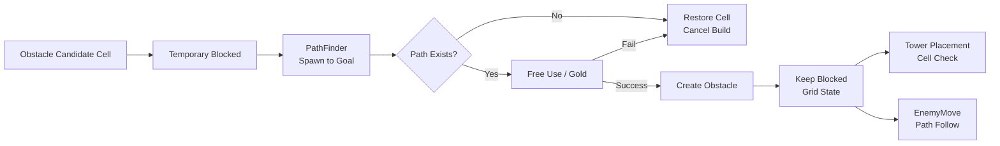

# Grid & Path Validation System

그리드 좌표계를 기준으로 장애물 배치, Spawn–Goal 경로 검증, 적 이동 경로 계산, 타워 배치 조건 확인을 연결하는 시스템이다. 장애물을 설치하기 전에 경로가 유지되는지 검사하고, 타워 배치와 적 이동이 같은 셀 좌표계를 사용하도록 구성했다.

## 목적

게임 필드는 그리드 셀을 기준으로 장애물과 타워의 위치, 적의 이동 경로를 처리한다. 장애물을 자유롭게 설치하면 Spawn에서 Goal까지의 경로가 완전히 막힐 수 있으므로 실제 오브젝트를 생성하기 전에 경로가 남는지 확인한다. 타워 배치와 적 이동도 `GridManager`가 제공하는 좌표 변환을 공유해 월드 위치와 셀 점유 상태가 서로 다른 기준으로 계산되지 않게 한다.

## 문제

- 장애물 설치로 적의 Spawn–Goal 이동 경로가 사라질 수 있다.
- 월드 좌표와 셀 좌표가 섞이면 장애물·타워 배치 판정과 적 이동 위치가 어긋날 수 있다.
- Spawn / Goal 셀, 장애물 셀, 타워가 점유한 셀은 서로 다른 제한 조건을 가진다.
- 타워는 장애물 셀 위에 설치되므로 장애물의 경로 유지 검증과 타워의 최종 설치 검증을 분리해야 한다.

## 설계

`GridManager`는 그리드 크기와 원점, 셀 크기, Spawn / Goal, 셀별 blocked 상태를 관리하고 월드 좌표와 셀 좌표를 변환한다. `GridNode`는 blocked 상태와 A* 탐색에 사용하는 비용·부모 노드를 보관하며, `PathFinder`는 이 노드들을 이용해 두 셀 사이의 경로를 계산한다.

`ObstacleBuilder`는 설치 후보 셀을 임시로 blocked 처리한 뒤 `PathFinder`로 Spawn–Goal 경로를 검사한다. 경로가 없으면 blocked 상태를 원복하고 설치를 취소한다. 경로가 있으면 무료 설치권 또는 골드를 처리한 뒤 장애물을 생성하고 blocked 상태를 유지한다. 비용 처리에 실패한 경우에도 blocked 상태를 원복한다.

`TowerController`는 같은 Grid의 범위와 Spawn / Goal, `ObstacleBuilder`의 장애물 존재 여부, `FieldTowerManager`의 타워 점유 상태, 최대 설치 수를 조합해 최종 타워 설치 가능 여부를 판단한다. `EnemyMove`는 `PathFinder`가 반환한 경로의 셀 중심점을 순서대로 따라 이동한다.

## 주요 흐름



실제 검증 순서는 다음과 같다.

```text
1. 마우스 위치를 후보 셀로 변환한다.
2. Grid 범위, Spawn / Goal 여부, 기존 장애물 존재 여부를 확인한다.
3. 후보 셀을 임시 blocked 상태로 변경한다.
4. PathFinder로 Spawn에서 Goal까지 경로를 탐색한다.
5. 경로가 없으면 blocked 상태를 원복하고 설치를 취소한다.
6. 경로가 있으면 무료 설치권 또는 골드를 처리한다.
7. 비용 처리까지 성공하면 장애물을 생성하고 blocked 상태를 유지한다.
```

## A* Pathfinding

`PathFinder.FindPath`는 시작 셀과 목표 셀이 Grid 안에 존재하고 blocked 상태가 아닌지 먼저 확인한다. 탐색은 상하좌우 네 방향으로 진행하며, Manhattan distance를 휴리스틱으로 사용한다. blocked 노드와 이미 닫힌 노드는 다음 후보에서 제외한다.

목표 노드에 도달하면 부모 노드를 역추적해 `List<GridNode>` 경로를 반환한다. 시작·목표 셀이 유효하지 않거나 도달 가능한 경로가 없으면 `null`을 반환한다. open 목록은 `List<GridNode>`에서 매 반복마다 가장 낮은 비용의 노드를 찾는 현재 구현을 그대로 사용한다.

## 장애물 설치 검증

`ObstacleBuilder.TryPlaceObstacle`은 셀 범위와 Spawn / Goal, 기존 장애물을 검사한 뒤 경로 검증을 수행한다. 경로가 확인되기 전에는 설치 비용을 사용하거나 장애물 GameObject를 생성하지 않는다. 경로가 유지될 때 무료 설치권을 우선 확인하고, 무료 횟수가 없으면 골드 결제를 요청한다.

장애물을 제거할 때는 해당 셀에 타워가 있는지 확인한다. 제거가 가능하면 장애물 참조를 비우고 Grid 노드를 이동 가능한 상태로 되돌린 뒤, 유료 설치 비용 또는 무료 설치 횟수를 반환한다. Terrain 지점이 갱신되면 `GridManager.OnSetSpawnAndGoalPoint`를 통해 기존 장애물과 blocked 상태를 초기화하고 새 Spawn / Goal을 반영한다.

## 타워 배치와의 관계

타워는 자유 셀이 아니라 장애물이 존재하는 셀 위에 설치된다. 장애물 설치 단계에서 Spawn–Goal 경로 유지 여부를 먼저 검증하고, Tower Build 단계에서는 다음 조건을 추가로 확인한다.

- Grid 범위 내부인지
- Spawn / Goal 셀이 아닌지
- 해당 셀에 장애물이 있는지
- 기존 타워가 점유하고 있지 않은지
- 현재 최대 설치 수를 초과하지 않는지

검증을 통과해 생성된 타워는 `FieldTowerManager`에 등록된다. `FieldTowerManager`는 셀별 타워 배열과 전체 타워 목록을 관리한다. 타워는 이미 경로를 차단하는 장애물 셀 위에 놓이며, 타워 등록 자체가 Grid 노드를 새로 blocked 처리하지는 않는다.

따라서 Grid & Path Validation은 좌표·장애물·경로 상태를 담당하고, Tower Build System은 큐의 타워 UID를 실제 필드 타워로 생성하고 등록하는 최종 설치 흐름을 담당한다.

## 적 이동과의 관계

`EnemyMove.Initialize`는 전달받은 Grid와 `PathFinder`를 사용해 현재 셀부터 Goal까지 경로를 계산한다. 경로가 없으면 초기화에 실패하며, 경로가 있으면 각 `GridNode`의 셀 중심점을 순서대로 이동한다. 마지막 노드에 도착하면 목표 도착 이벤트를 발생시키고 적 오브젝트를 제거한다.

현재 구현은 적 초기화 시 계산한 경로를 따라 이동하는 구조다. 장애물 상태가 변경될 때 이미 이동 중인 모든 적의 경로를 자동으로 다시 계산하는 흐름은 확인되지 않는다.

## 주요 클래스

| 클래스 | 역할 |
|---|---|
| `GridManager` | 그리드 크기·원점·셀 크기, 좌표 변환, Spawn / Goal, blocked 셀 상태 관리 |
| `GridNode` | blocked 상태와 A* 탐색 비용, 부모 노드 보관 |
| `PathFinder` | 네 방향 A*로 시작 셀에서 목표 셀까지의 경로 계산 |
| `ObstacleBuilder` | 장애물 후보 셀 검증, 임시 blocked 처리, 경로·비용 확인 후 설치 확정 |
| `EnemyMove` | 초기화 시 경로를 계산하고 셀 중심점을 따라 이동 |
| `TowerController` | Grid·장애물·타워 점유·최대 설치 수를 조합해 최종 설치 가능 여부 판단 |
| `FieldTowerManager` | 셀별 타워 점유 상태와 필드 타워 목록 관리 |

## 제한 사항 / 개선 가능성

- 장애물 변경 후 이미 이동 중인 적의 경로를 실시간으로 다시 계산하는 구조는 아니다.
- 경로 캐시나 우선순위 큐 기반 탐색은 현재 코드에서 확인되지 않는다.
- `PathFinder`는 open 목록에서 최소 비용 노드를 선형 탐색하고, 탐색 전 모든 GridNode의 비용과 부모를 초기화한다.
- 맵 크기나 동시에 생성되는 적 수가 커질 경우 Unity Profiler로 경로 탐색 호출 횟수와 실행 시간을 먼저 측정할 필요가 있다.
- 측정 결과 병목이 확인되면 공통 경로 재사용이나 open 목록 탐색 방식 개선을 검토할 수 있다.

## 관련 문서

- [Tower Build System](BuildSystem.md)
- [Wave & Enemy System](WaveAndEnemySystem.md)
