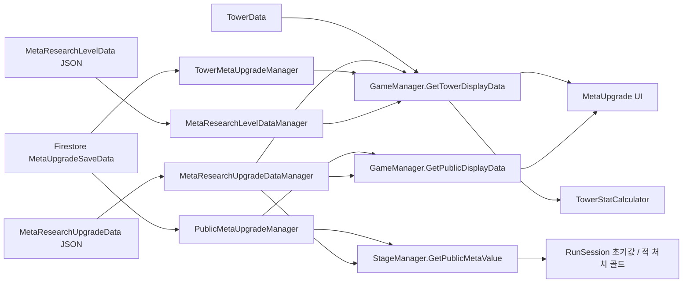
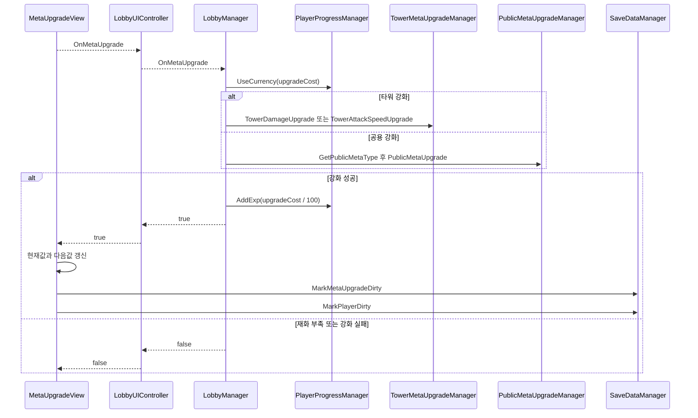

# 메타 성장 시스템

## 1. 개요

스테이지 종료 후에도 유지되는 플레이어 연구 레벨, 메타 재화, 타워별 강화, 공용 시작 옵션을 관리한다. 정적 강화 규칙과 계정별 강화 레벨을 분리하고, 실제 전투 스탯 계산 시 두 데이터를 결합한다.

## 2. 구현 목적

- 반복 플레이 결과가 다음 런의 성장으로 이어지는 장기 진행 구조를 만든다.
- 타워 종족·등급별 공격력과 공격속도를 독립적으로 강화한다.
- 시작 골드, 드랍 골드, 무료 장애물, 지형 갱신처럼 타워 외 공용 효과를 지원한다.
- 강화 비용과 증가식을 데이터에서 조정한다.
- 연구 레벨에 따라 타워 등급을 단계적으로 개방한다.

## 3. 해결하려던 문제

영구 강화 값을 TowerData 자체에 저장하면 모든 사용자가 같은 값을 공유하게 되고 원본 밸런스가 훼손된다. UI가 직접 스탯을 계산하면 전투 표시와 실제 값이 달라질 수 있으며, 타워 강화와 공용 강화의 저장 구조도 서로 달라진다.

## 4. 주요 클래스

| 클래스 | 책임 |
|---|---|
| [PlayerProgressManager](../../Assets/02.Scripts/Managers/Data/Meta/PlayerProgressManager.cs) | 연구 레벨, 경험치, 메타 재화 변경 |
| [TowerMetaUpgradeManager](../../Assets/02.Scripts/Managers/Meta/TowerMetaUpgradeManager.cs) | 종족·등급별 공격력/공격속도 강화 레벨 |
| [PublicMetaUpgradeManager](../../Assets/02.Scripts/Managers/Meta/PublicMetaUpgradeManager.cs) | 공용 강화 타입별 레벨 |
| [MetaResearchUpgradeDataManager](../../Assets/02.Scripts/Managers/Data/Meta/MetaResearchUpgradeDataManager.cs) | 강화 최대치, 비용, 증가 방식 데이터 |
| [MetaResearchLevelDataManager](../../Assets/02.Scripts/Managers/Data/Meta/MetaResearchLevelDataManager.cs) | 레벨별 필요 경험치와 해금 등급 |
| [GameManager](../../Assets/02.Scripts/Managers/Core/GameManager.cs) | 정적 기본값과 저장 레벨을 표시 데이터로 결합 |
| [TowerStatCalculator](../../Assets/02.Scripts/Tower/TowerStatCalculator.cs) | 메타 스탯에 런·아이템·스킬 강화를 합성 |
| [MetaUpgradeView](../../Assets/02.Scripts/UI/View/Lobby/MetaUpgradeView.cs) | 강화 요청 이벤트 발생, 성공 후 표시 갱신과 dirty flag 설정 |
| [LobbyUIController](../../Assets/02.Scripts/UI/Controllers/Lobby/LobbyUIController.cs) | MetaUpgradeView의 요청을 LobbyManager 쪽 이벤트로 중계 |
| [LobbyManager](../../Assets/02.Scripts/Managers/Lobby/LobbyManager.cs) | 재화 사용, 타워·공용 강화 호출, 연구 경험치 반영 |

## 5. 데이터 흐름



정적 데이터는 “레벨당 증가량과 비용”, 저장 데이터는 “현재 레벨”만 보유한다.

## 6. 이벤트 흐름



## 7. 핵심 구현 방식

### 정적 규칙과 저장 상태 분리

TowerUpgradeSaveData는 type, grade, damageLevel, attackSpeedLevel만 저장한다. 실제 현재 값은 GameManager가 TowerData의 기본값과 MetaResearchUpgradeData를 결합해 계산한다.

```csharp
case CostIncreaseType.Percent:
    return baseValue * (1f + valueLevelPer * level);
case CostIncreaseType.Flat:
    return baseValue + valueLevelPer * level;
```

```text
강화 비용 = ceil(costBase × costGrow^currentLevel)
```

### 런타임 스탯 합성

TowerStatCalculator는 메타 강화가 반영된 기본 공격력·속도에 현재 런의 일반 강화, 아이템 강화, 타워 수 스킬 강화를 더한다. 영구 성장과 런 성장이 서로의 원본 데이터를 수정하지 않는다.

### 지연 생성

특정 종족·등급 또는 공용 타입의 저장 행이 없으면 조회 시 0레벨 데이터를 생성한다. 신규 저장 데이터와 기존 사용자 데이터 모두 동일한 조회 경로를 사용한다.

## 8. 설계 방식

### 런타임 상태와 영구 성장 상태 분리

전투 중 적용되는 런 강화와 계정 단위 메타 성장은 수명주기가 다르므로 별도 상태로 관리한다. 메타 성장은 Firestore에 저장되는 계정 진행 데이터로 유지되고, 런 강화는 스테이지 진행 중에만 유지된다. 이 구분으로 런 종료 시 초기화할 값과 다음 실행에도 복원할 값을 분명히 한다.

### 원본 데이터와 계산 결과 분리

최종 타워 스탯은 원본 `TowerData`를 직접 수정하지 않고 기본값, 영구 성장 단계, 현재 런 강화 단계를 계산 과정에서 순서대로 합산한다. JSON의 밸런스 원본과 사용자별 진행 상태, 전투 중 계산 결과가 섞이지 않으며 각 단계의 적용 위치를 추적할 수 있다.

### 누락된 진행 데이터 보완

`TowerMetaUpgradeManager`와 `PublicMetaUpgradeManager`는 요청한 강화 항목이 저장 목록에 없으면 0레벨 항목을 만든다. 신규 콘텐츠가 추가되거나 이전 저장 데이터에 항목이 없어도 동일한 조회 흐름을 사용할 수 있고, 실제 강화 성공 시 관련 저장 상태만 변경 대상으로 표시한다.

## 9. 문제 해결 과정

현재 코드는 TowerData의 기본값을 직접 변경하지 않는다. GameManager가 저장된 메타 레벨을 기본값에 적용하고, TowerStatCalculator가 그 결과에 현재 런의 강화 단계를 더해 최종 값을 계산한다. 이 계산 순서는 코드에서 확인되지만, 해당 구조를 도입하기 전 어떤 중복 적용 문제가 있었는지는 기록에서 확인하지 못했다.

TowerMetaUpgradeManager.GetSaveData와 PublicMetaUpgradeManager.GetMetaSaveData는 요청한 조합이 저장 목록에 없으면 0레벨 항목을 추가한다. 따라서 모든 강화 조합을 초기 생성하지 않고 조회된 항목부터 목록에 포함한다.

## 10. 결과

- 6종족 × 6등급 타워의 공격력과 공격속도를 독립적으로 강화할 수 있다.
- 4종 공용 강화가 스테이지 시작 상태와 처치 보상에 반영된다.
- 연구 레벨 12단계와 등급 해금 규칙을 데이터로 관리한다.
- 현재값, 다음값, 비용을 동일 계산 경로에서 생성해 UI와 실제 전투 값의 불일치를 줄였다.
- 강화 성공 시 메타와 재화 저장 영역을 함께 dirty 처리한다.

## 11. 개선 가능성

- maxLevel과 비용 검증을 UI가 아니라 도메인 서비스에서도 강제한다.
- 재화 차감과 강화 레벨 증가를 하나의 MetaUpgradeTransaction으로 묶는다.
- TowerMetaUpgradeManager의 List.Find를 종족·등급 복합 키 Dictionary로 변경한다.
- TowerStatCalculator의 전역 static 의존성을 인스턴스 서비스로 바꿔 테스트 가능성을 높인다.
- 강화 공식과 경계값을 단위 테스트로 검증한다.

## 12. 포트폴리오에 강조할 점

- 기본 데이터와 사용자 진행 데이터를 분리한 영구 성장 모델
- 메타·런·아이템·스킬 강화가 중복 적용되지 않는 단계별 스탯 계산
- Percent와 Flat 공식을 데이터로 선택하는 확장 가능한 규칙
- 신규·기존 사용자 저장을 함께 처리하는 지연 생성 전략
