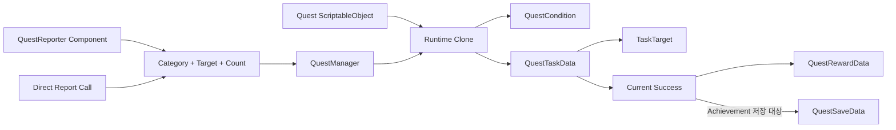
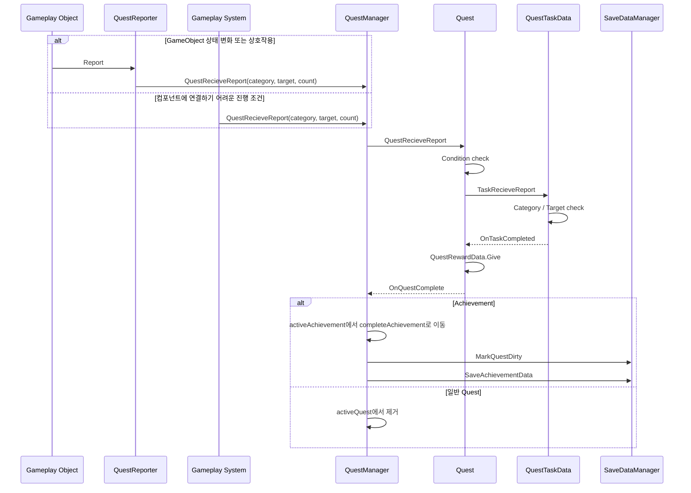

# 퀘스트 및 업적 시스템

## 1. 개요

게임플레이 시스템이 카테고리·대상·증가량만 보고하면 등록된 퀘스트와 업적이 조건을 평가하고 진행도를 갱신하는 범용 시스템이다. 원본은 ScriptableObject로 제작하고 런타임에는 복제본을 사용한다.

## 2. 구현 목적

- QuestCategory로 정의된 사건을 동일한 QuestRecieveReport 인터페이스로 전달할 수 있게 한다.
- 퀘스트 원본 에셋이 플레이 중 변경되지 않게 한다.
- 대상 비교와 선행 조건을 교체 가능한 객체로 구성한다.
- 업적 진행도와 완료 상태를 저장한다.
- 전용 EditorWindow에서 퀘스트·대상·조건 에셋을 제작할 수 있게 한다.

## 3. 해결하려던 문제

각 게임 시스템이 특정 업적 클래스를 직접 호출하면 업적 추가 때 전투 코드를 수정해야 한다. ScriptableObject 원본에 진행도를 저장하면 에디터 에셋이 오염되고 모든 인스턴스가 상태를 공유한다. 완료 처리 중 활성 목록을 수정하면 열거 예외도 발생할 수 있다.

## 4. 주요 클래스

| 클래스 | 책임 |
|---|---|
| [QuestManager](../../Assets/02.Scripts/Managers/Core/QuestManager.cs) | 등록, 보고 분배, 활성·완료 목록, 저장 |
| [Quest](../../Assets/02.Scripts/Quest/Quest.cs) | 카테고리, 조건, Task, 보상, 완료 생명주기 |
| [Achievement](../../Assets/02.Scripts/Quest/Achievement.cs) | 저장 가능한 Quest 특수화 |
| [QuestReporter](../../Assets/02.Scripts/Quest/QuestReporter.cs) | GameObject의 상태 변화나 상호작용을 Inspector 설정에 따라 공통 보고 흐름으로 전달 |
| [QuestTaskData](../../Assets/02.Scripts/Quest/Task/QuestTaskData.cs) | 대상 필터, 성공 횟수, 완료 판정 |
| [TaskTarget](../../Assets/02.Scripts/Quest/Task/Target/TaskTarget.cs) | 보고 대상 비교 추상화 |
| [EnemyTarget](../../Assets/02.Scripts/Quest/Task/Target/EnemyTarget.cs) / [UIDTarget](../../Assets/02.Scripts/Quest/Task/Target/UIDTarget.cs) | 적 타입 또는 문자열 UID 비교 구현 |
| [QuestCondition](../../Assets/02.Scripts/Quest/Condition/QuestCondition.cs) | 퀘스트 활성 조건 추상화 |
| [QuestRewardData](../../Assets/02.Scripts/Quest/QuestRewardData.cs) | 완료 보상 지급 |
| [QuestEditorWindow](../../Assets/02.Scripts/Editor/QuestEditorWindow.cs) | 퀘스트·Target·Condition 제작 도구 |

## 5. 데이터 흐름



원본 Quest와 Task는 등록 시 복제되며, 진행 상태는 복제본에만 존재한다.

## 6. 이벤트 흐름



## 7. 핵심 구현 방식

### 범용 보고 필터

```csharp
if (TaskCategory != category) return;
if (!TaskContainsTarget(target)) return;

CurrentSuccess = TaskAction.Run(
    actionType, currentSuccess, successCount);

if (IsCompleted)
    OnTaskCompleted?.Invoke();
```

Category는 사건 종류, TaskTarget은 사건 대상을 판별한다. targets가 비어 있으면 해당 카테고리의 모든 대상을 허용한다.

### 런타임 복제

Quest.Clone은 ScriptableObject를 Instantiate하고 QuestTaskData를 새 객체로 복제한다. 원본 정의와 플레이 상태를 분리한다.

### 안전한 목록 변경

QuestManager는 활성 목록의 복사본을 순회한다. 보고 중 퀘스트가 완료되어 원본 목록에서 제거되어도 반복이 안전하다.

## 8. 설계 방식

### ScriptableObject 원본 정의와 런타임 진행 상태 분리

`ScriptableObject`는 퀘스트와 업적의 원본 정의로 사용하고, 등록할 때 `Quest.Clone`과 `QuestTaskData.Clone`으로 플레이 중 진행 상태를 가진 객체를 만든다. 플레이 중 수치 변경이 원본 에셋에 기록되는 것을 막고, 저장 데이터에는 UID와 진행 상태만 따로 기록할 수 있다.

### 공통 Report API 기반 진행 처리

보고 지점은 개별 퀘스트나 업적을 직접 찾지 않고 카테고리, 대상, 횟수를 공통 `QuestManager.QuestRecieveReport` 흐름에 전달한다. `QuestManager`가 활성 퀘스트와 업적에 보고를 분배하고, `QuestTaskData`, `TaskTarget`, `QuestCondition`이 카테고리·대상·활성 조건을 판정한다. 콘텐츠가 늘어나도 보고하는 오브젝트나 게임 시스템이 개별 정의를 알 필요가 없다.

### Component 기반 Quest Reporting

적 처치, 아이템 획득, 타워 업그레이드처럼 특정 GameObject의 상태 변화나 상호작용에 연결되는 진행 조건은 `QuestReporter` 컴포넌트로 보고할 수 있다. 각 오브젝트는 Inspector에서 `Category`, `Target`, `Success Count`, `Target Tags`를 설정한다. `QuestReporter.Report`를 직접 호출하거나, 설정한 태그의 Collider가 진입·이탈할 때 공통 Report 흐름으로 진행도를 전달한다.

`KillEnemy`의 경우 Enemy 오브젝트가 `QuestReporter`를 보유하고, `Enemy`의 체력이 0 이하가 되어 `Die` 처리가 실행될 때 `onDead` UnityEvent가 `QuestReporter.Report`를 호출한다. 목표 지점 도착은 `EnemyMove`의 별도 도착 흐름이므로 적 처치 보고에 포함되지 않는다. `CollectItem`, `UpgradeTower`도 특정 오브젝트나 상호작용 시점에서 같은 컴포넌트 보고 방식을 사용할 수 있다.

반면 스테이지 클리어(`ClearStage`)처럼 특정 GameObject 컴포넌트에 연결하기 어려운 진행 조건은 `StageManager`가 공통 Report API를 직접 호출한다. 따라서 전체 보고 구조는 컴포넌트 기반 보고와 코드 직접 보고를 함께 사용한다.

### 완료 처리와 목록 변경 분리

Task 완료, Quest 완료, `QuestManager`의 목록 이동은 이벤트로 이어진다. 보고 도중 완료 항목이 활성 목록에서 제거될 수 있으므로 복사본을 순회하고 원본 포함 여부를 다시 확인한다. 이는 특정 관찰 패턴의 완전한 적용을 주장하기보다, 진행 계산과 완료 후 목록 갱신의 책임을 나눈 구조다.

## 9. 문제 해결 과정

`QuestManager`는 `QuestCategory`, target, count를 받는 공통 보고 메서드를 제공한다. GameObject의 생명주기나 상호작용과 연결되는 조건은 Inspector에서 설정한 `QuestReporter`를 통해 전달하고, `ClearStage`와 `BuildTower`처럼 시스템 흐름에서 집계하거나 특정 컴포넌트에 귀속하기 어려운 조건은 `StageManager`가 같은 API를 직접 호출한다. 두 경로는 보고 시작점만 다르고 이후의 분배와 조건 판정 흐름은 공유한다.

완료 이벤트가 목록을 변경하는 문제는 활성 목록 복사 순회와 Contains 재검사로 해결했다. 저장 복원 시 기존 업적을 UID로 찾아 복제하고, 새 버전에 추가된 업적은 저장에 없더라도 자동 등록한다.

## 10. 결과

- QuestCategory enum에 KillEnemy, ClearStage, CollectItem, UpgradeTower, BuildTower, Achievement가 정의되어 있다.
- `ClearStage`와 `BuildTower`는 `StageManager`가 공통 Report API를 직접 호출한다.
- `KillEnemy`는 Enemy의 `onDead` UnityEvent와 연결된 `QuestReporter`가 보고하며, 목표 지점 도착은 적 처치로 보고하지 않는다.
- `CollectItem`, `UpgradeTower`처럼 특정 오브젝트의 생명주기나 상호작용에 연결되는 조건도 `QuestReporter`를 통해 보고할 수 있다.
- EASY, NORMAL, HARD, HELL 난이도 업적을 동일 데이터 모델로 관리한다.
- 진행 중·완료 업적을 분리하고 UI에서 정렬·필터링한다.
- 저장 버전에 없던 신규 업적도 로드 후 추가된다.
- 제작·검색·중복 UID 검사·디버그 완료 기능을 에디터 도구로 제공한다.

## 11. 개선 가능성

- active 목록을 QuestCategory별 Dictionary로 인덱싱해 매 보고의 전체 순회를 줄인다.
- 보고마다 생성하는 List 복사를 재사용 버퍼 또는 지연 완료 큐로 대체한다.
- QuestTaskData.Clone은 targets = this.targets로 대입하므로 TaskTarget 참조를 공유한다. 런타임에서 Target 에셋을 변경하지 않는다는 계약을 명시하거나 필요한 경우 복제 정책을 추가한다.
- QuestRewardType.Item 분기는 현재 플레이어 인벤토리에 아이템을 추가하지 않고 player dirty flag만 설정한다. 의도된 미구현인지 TODO: 확인 필요.
- 완료 시 fire-and-forget으로 호출하는 원격 저장을 저장 큐로 옮겨 실패·재시도를 관리한다.
- 일반 Quest 진행에서도 MarkQuestDirty가 호출되지만 QuestManager.GetSaveData는 Achievement만 수집한다. 일반 Quest를 저장하지 않는 것이 의도인지 TODO: 확인 필요.
- QuestStat.Comoplete 등 명명 오타를 마이그레이션 가능한 방식으로 정리한다.
- 업적 UID 변경을 지원하는 별칭 또는 마이그레이션 테이블을 둔다.
- TaskAction과 Condition 조합을 단위 테스트한다.

## 12. 포트폴리오에 강조할 점

- 게임 시스템과 업적 정의를 분리한 범용 보고 구조
- Inspector에서 구성하는 `QuestReporter`와 코드 직접 호출을 함께 사용하는 보고 진입점
- ScriptableObject 원본과 런타임 진행 상태를 복제로 분리
- TaskTarget·QuestCondition 추상화와 완료 이벤트 연쇄
- 콘텐츠 추가를 지원하는 전용 에디터와 저장 호환 처리
