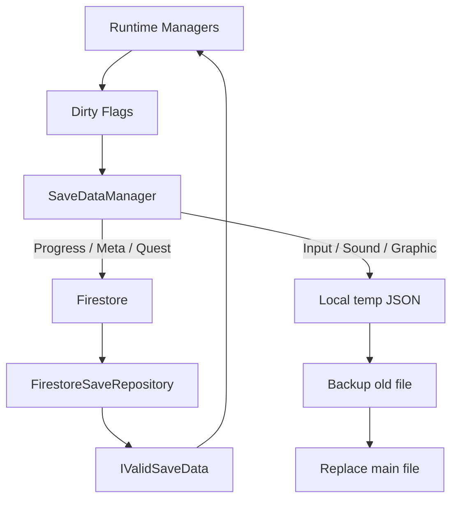
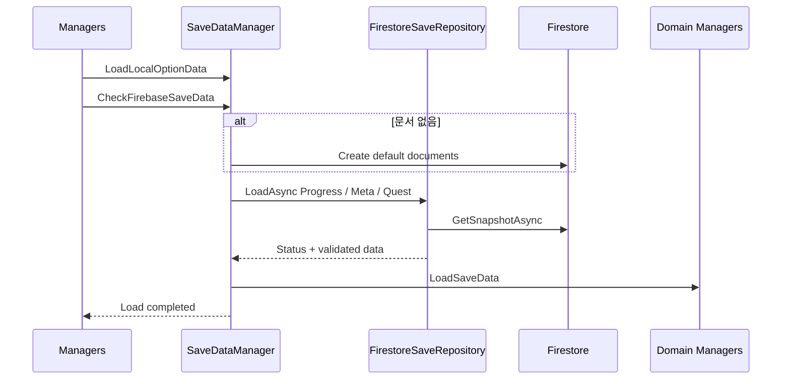

# 저장 및 불러오기 시스템

## 1. 개요

플레이 환경에 종속되는 옵션은 로컬 JSON으로, 계정에 종속되는 진행 상태는 Firebase Firestore로 저장한다. 저장 모델 검증, 신규 사용자 기본 데이터, 시간 초과, dirty flag, 로컬 임시 파일 교체를 포함한다.

## 2. 구현 목적

- 기기 옵션과 계정 진행 데이터의 저장 위치를 분리한다.
- 네트워크 실패가 데이터 손상과 동일하게 취급되지 않도록 결과를 세분화한다.
- 신규 사용자가 원격 문서를 갖고 있지 않아도 기본 상태로 시작한다.
- 변경되지 않은 데이터를 매번 쓰지 않는다.
- 로컬 파일 저장 중 중단되어도 이전 파일을 보존한다.

## 3. 해결하려던 문제

단일 JSON에 모든 데이터를 저장하면 계정 동기화와 기기별 옵션이 섞인다. Firebase API 예외를 직접 전파하면 호출자가 Timeout, 권한, 문서 없음, 손상을 구분하기 어렵다. 또한 매 변경마다 전체 데이터를 저장하면 네트워크 비용과 지연이 증가한다.

## 4. 주요 클래스

| 클래스 | 책임 |
|---|---|
| [SaveDataManager](../../Assets/02.Scripts/Managers/Data/Save/SaveDataManager.cs) | 저장 정책, 문서 분리, dirty flag, 기본값, 로컬 파일 |
| [FirestoreSaveRepository](../../Assets/02.Scripts/Firebase/Save/FirestoreSaveRepository.cs) | Firestore 로드와 오류 상태 변환 |
| [FirebaseInitializer](../../Assets/02.Scripts/Firebase/FirebaseInitializer.cs) | Firebase 의존성 확인과 Auth/Firestore 초기화 |
| [Managers](../../Assets/02.Scripts/Managers/Core/Managers.cs) | 초기 로드 순서와 종료 저장 호출 |
| IValidSaveData | 역직렬화된 저장 모델의 도메인 유효성 계약 |
| PlayerProgressData | 연구 레벨, 경험치, 메타 재화 |
| MetaUpgradeSaveData | 타워·공용 메타 강화 묶음 |
| QuestSaveDataList | 업적 상태와 성공 횟수 |

## 5. 데이터 흐름



## 6. 이벤트 흐름



저장이 필요한 호출 지점에서 MarkPlayerDirty, MarkMetaUpgradeDirty, MarkQuestDirty 등 해당 dirty 메서드를 명시적으로 호출한다. 이후 SaveDataManager의 저장 메서드는 해당 dirty flag가 true인 항목만 SetAsync 또는 로컬 파일 쓰기를 수행한다.

## 7. 핵심 구현 방식

### 타입화된 로드 결과

FirestoreSaveRepository는 SDK 예외를 다음 상태로 변환한다.

- Success
- DocumentMissing
- NetworkError
- DataCorrupted
- Timeout
- PermissionError
- UnknownError

Task.WhenAny로 10초 제한 시간을 적용하고, ConvertTo 이후 IValidSaveData를 검사한다.

### 로컬 파일 교체

```csharp
File.WriteAllText(tempPath, json);
if (File.Exists(path))
    File.Copy(path, backupPath, true);
File.Copy(tempPath, path, true);
File.Delete(tempPath);
```

완성된 temp 파일이 준비된 뒤 기존 파일을 backup하고 본 파일을 교체한다.

### 관심사별 원격 문서

PlayerProgress, MetaUpgrade, Quest를 별도 문서로 저장한다. 한 시스템의 변경이 다른 대형 문서 전체 쓰기로 이어지지 않는다.

## 8. 설계 방식

### 저장소 접근 책임 분리

Firebase Firestore 접근은 `FirestoreSaveRepository`로 분리했다. `SaveDataManager`는 Firebase API의 세부 예외보다 `Success`, `DocumentMissing`, `NetworkError`, `PermissionError`, `Timeout`, `DataCorrupted` 같은 로드 결과 상태를 기준으로 흐름을 처리한다. 이는 외부 저장소 접근 책임을 경계로 분리한 Repository-style Save Access이며, 정형화된 패턴 전체를 구현했다고 단정하지 않는다.

### 저장 데이터 검증과 신규 사용자 구분

원격에서 읽은 데이터는 역직렬화한 뒤 `IValidSaveData`를 통해 값의 유효성을 검사한다. 문서가 없는 `DocumentMissing`은 신규 사용자 상태로 처리해 기본 데이터를 생성하고, 네트워크·권한·시간 초과·데이터 손상은 실제 로드 실패로 구분한다. 기본 데이터 생성과 오류 대응이 같은 실패 분기에 섞이지 않는다.

### 저장 범위와 수명주기 분리

로컬 옵션과 계정 진행은 저장 위치와 수명주기를 나누고, 원격 진행 데이터도 PlayerProgress, MetaUpgrade, Quest 문서로 구분한다. 변경된 영역만 저장 대상으로 표시하며 로컬 파일은 임시 파일 작성 후 교체해 쓰기 도중 기존 파일이 손상될 가능성을 줄인다.

## 9. 문제 해결 과정

원격 문서 없음은 오류가 아니라 신규 사용자 상태다. 저장소 접근 결과에서 `DocumentMissing`을 별도 상태로 분리하고 `SaveDataManager`가 기본 모델을 메모리와 Firestore 양쪽에 적용한다.

네트워크 지연으로 로딩이 무한정 대기하지 않도록 타임아웃을 추가했다. 데이터 변환 성공만으로 신뢰하지 않고 음수 재화, 잘못된 enum, null 컬렉션을 IsValid로 검사한다.

## 10. 결과

- 로그인 사용자의 진행 상태를 세 문서로 복원한다.
- 비로그인 사용자는 Managers.Start에서 null을 전달해 메모리의 기본 진행 상태로 초기화된다. 이 진행 상태를 로컬 진행 파일로 저장하는 코드는 확인되지 않았다.
- 기기별 입력·사운드·그래픽 옵션을 로컬에 유지한다.
- 잘못된 저장 데이터와 네트워크 실패를 구분한다.
- dirty가 아닌 데이터의 불필요한 쓰기를 차단한다.
- 신규 계정의 기본 문서를 자동 생성한다.

## 11. 개선 가능성

- Managers.OnApplicationQuit의 async void는 종료 완료를 보장하지 않는다. 중요한 저장은 변경 직후 또는 안전한 체크포인트에서 완료해야 한다.
- 세 원격 문서 로드를 Task.WhenAll로 병렬화한다.
- 저장도 Repository로 통합해 로드와 동일한 재시도·결과 정책을 사용한다.
- 저장 모델에 schemaVersion과 마이그레이션을 추가한다.
- 변경 중 진행된 비동기 저장이 완료되며 dirty를 false로 덮는 경쟁 조건을 버전 카운터로 방지한다.
- 네트워크 실패 시 로컬 outbox에 기록하고 다음 접속에서 재시도한다.
- backup 파일 자동 복원과 체크섬을 추가한다.
- 사용자에게 재시도·오프라인 진행 UI를 제공한다.

## 12. 포트폴리오에 강조할 점

- 로컬 옵션과 계정 진행을 수명주기 기준으로 분리
- Firebase 오류를 게임 흐름에서 처리할 수 있는 로드 결과로 변환한 저장소 접근 경계
- 타임아웃, 기본값, 데이터 검증, dirty flag를 포함한 저장 실패 처리
- 로컬 temp/backup 교체 방식과 원격 문서 분할 전략
