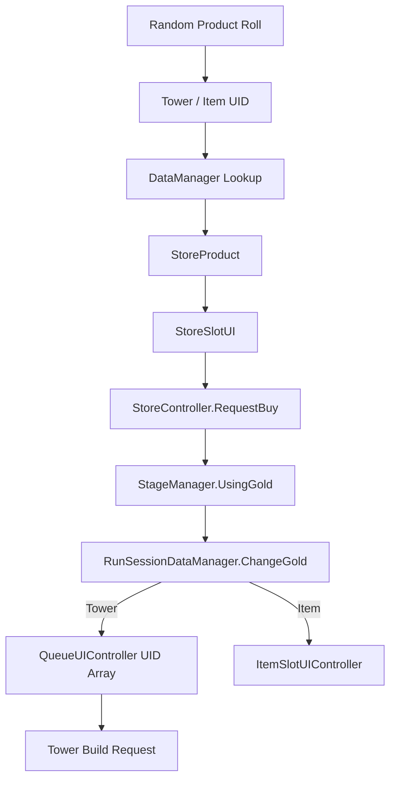
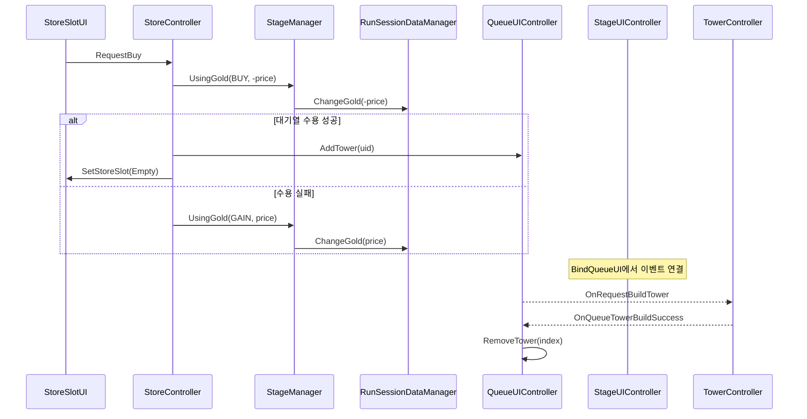

# 상점 및 타워 대기열 시스템

## 1. 개요

웨이브 사이에 타워와 아이템 상품을 무작위 생성하고, 구매한 타워를 즉시 필드에 생성하지 않고 대기열에 보관하는 시스템이다. 구매, 골드 차감, 슬롯 수용 여부, 설치 요청을 분리한다.

## 2. 구현 목적

- 상점의 랜덤 상품과 플레이어 보유 상태를 분리한다.
- 필드가 가득 찼거나 배치할 위치가 없어도 구매한 타워를 대기열에 보관한다.
- 구매 실패 시 골드를 자동 환불한다.
- 대기열 슬롯 클릭을 타워 설치 명령으로 변환한다.
- 웨이브 종료 시 상점을 갱신하고 게임 종료 시 대기열 가치를 정산한다.

## 3. 해결하려던 문제

상점 클릭이 직접 타워를 생성하면 구매 UI가 그리드, 타워 프리팹, 배치 규칙까지 알아야 한다. 슬롯이 가득 찬 상태에서 선결제하면 골드만 차감될 수 있으며, 설치 취소와 상품 상태도 복잡해진다.

## 4. 주요 클래스

| 클래스 | 책임 |
|---|---|
| [StoreController](../../Assets/02.Scripts/UI/Controllers/Stage/StoreController.cs) | 상품 생성, 구매·리롤·환불, 골드 표시 |
| [StoreProduct](../../Assets/02.Scripts/UI/Controllers/Stage/StoreController.cs) | UID, 상품 타입, 가격, 등급, 아이콘을 묶은 표시 모델 |
| [StoreSlotUI](../../Assets/02.Scripts/UI/Store/StoreSlotUI.cs) | 상품 표시와 클릭·호버 전달 |
| [QueueUIController](../../Assets/02.Scripts/UI/Controllers/Stage/QueueUIController.cs) | 슬롯별 타워 UID 보관, 설치 요청 발행 |
| [QueueSlotUI](../../Assets/02.Scripts/UI/Queue/QueueSlotUI.cs) | 슬롯 표시 및 인덱스 기반 클릭 전달 |
| [TowerController](../../Assets/02.Scripts/Tower/TowerController.cs) | 대기열 요청을 실제 필드 설치로 변환 |
| [ItemSlotUIController](../../Assets/02.Scripts/UI/Controllers/Stage/ItemSlotUIController.cs) | 구매 아이템 수용과 슬롯 상태 관리 |
| [StageUIController](../../Assets/02.Scripts/UI/Controllers/Stage/StageUIController.cs) | 큐의 설치 요청과 TowerController의 설치 성공 이벤트를 바인딩 |
| [StageManager](../../Assets/02.Scripts/Managers/Stage/StageManager.cs) | StoreController가 호출하는 UsingGold를 통해 세션 골드 변경을 중계 |
| [RunSessionDataManager](../../Assets/02.Scripts/Managers/Data/RunSessionDataManager.cs) | 골드 잔액을 보유하고 ChangeGold 결과와 변경 이벤트 제공 |

## 5. 데이터 흐름



StoreProduct는 도메인 원본 전체를 UI 슬롯에 노출하지 않고 상점에 필요한 값만 전달한다.

## 6. 이벤트 흐름



## 7. 핵심 구현 방식

구매는 선차감 후 수용 실패 시 환불하는 단순 트랜잭션이다.

```csharp
if (!UsingGold(GoldChangedReason.BUY, -product.price))
    return;

bool success = product.type == StoreProductType.Tower
    ? queueSlots.AddTower(product.uid)
    : itemSlots.AddItemSlot(product.uid);

if (!success)
{
    stage.UsingGold(GoldChangedReason.GAIN, product.price);
    return;
}
```

QueueUIController는 UID 배열을 실제 상태로, QueueSlotUI를 표시 상태로 유지한다. 슬롯 클릭 시 인덱스와 UID가 현재 배열 값과 일치하는지 재검증한 뒤 설치 이벤트를 발행한다.

상점은 StageManager.OnWaveEndRefreshStore와 RunSessionDataManager.OnGoldAmountChanged를 구독해 웨이브 갱신과 골드 표시를 처리한다. 큐의 두 설치 이벤트는 StageUIController.BindQueueUI에서 연결되고 UnBindQueueUI에서 해제된다.

## 8. 설계 방식

### 구매 책임과 설치 책임 분리

`StoreController`는 골드 사용 가능 여부와 `QueueUIController.AddTower` 결과를 처리한다. 구매에 성공한 타워 UID는 큐 슬롯에 저장되고, 실제 그리드 배치 검증은 타워 건설 시스템에서 처리한다. 따라서 상점 UI는 그리드 배치 규칙이나 필드 점유 상태를 직접 알 필요가 없다.

### 큐 상태와 골드 상태의 일관성 유지

큐에 빈 공간이 없으면 구매를 확정하지 않는다. 골드를 차감한 뒤 큐가 타워를 수용하지 못하면 같은 가격을 환불하고 상품 슬롯도 유지한다. 이 흐름은 구매 실패와 이후의 설치 실패를 서로 다른 단계로 처리하면서 골드와 큐 상태가 어긋나지 않게 한다.

### 이벤트를 통한 설치 요청 전달

`QueueUIController`는 슬롯의 UID와 인덱스를 검증한 뒤 설치 요청 이벤트를 발생시키고, `StageUIController`가 이를 `TowerController`에 연결한다. 큐는 설치 절차를 직접 실행하지 않고 구매한 타워의 보관과 요청 전달에 집중한다.

## 9. 문제 해결 과정

구매 처리의 핵심은 결제와 인벤토리 반영의 일관성이다. 골드 차감 성공만으로 구매 완료로 보지 않고, Queue 또는 ItemSlot의 Add 결과가 true일 때만 상품 슬롯을 비운다. 수용 실패 시 동일 가격을 즉시 환불해 상태를 원복한다.

대기열에서도 클릭 이벤트가 오래된 슬롯 데이터로 들어오는 경우를 막기 위해 인덱스 범위, 빈 UID, 내부 UID 일치 여부를 다시 검사한다.

## 10. 결과

- 구매와 배치를 독립된 단계로 제공한다.
- 대기열 및 아이템 슬롯이 가득 찬 경우 자원 손실을 막는다.
- 웨이브 종료 시 상점이 자동 갱신된다.
- 타워, 아이템, 경험치 구매가 동일한 골드 변경 경로를 사용한다.
- 게임 종료 시 대기열 타워를 판매 가격으로 환산해 결과 계산에 포함할 수 있다.

## 11. 개선 가능성

- 상품 확률과 등급 범위를 하드코딩된 Random.Range가 아닌 확률 테이블로 이동한다.
- 현재 아이템 UID 선택 범위가 고정값이므로 DataManager의 실제 개수에 맞춘다.
- 구매를 PurchaseCommand와 PurchaseResult로 분리해 실패 원인을 UI에 표시한다.
- 상품 잠금, 시드 기반 랜덤, 리롤 이력 기능을 추가할 수 있는 모델 구조로 확장한다.
- Queue의 UID 배열과 Slot의 빈 상태를 하나의 SlotModel로 통합한다.
- 골드 차감과 수용을 하나의 원자적 서비스 메서드로 묶어 중간 이벤트 간섭을 차단한다.

## 12. 포트폴리오에 강조할 점

- 구매와 필드 배치를 대기열로 분리한 게임플레이 설계
- 결제 후 수용 실패를 고려한 환불 트랜잭션
- 이벤트로 상점, 큐, 타워 Controller의 결합도를 낮춘 구조
- UI 전용 StoreProduct 모델을 통한 표시 관심사 분리
