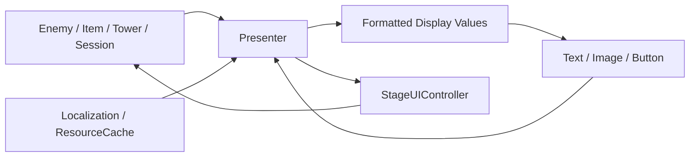
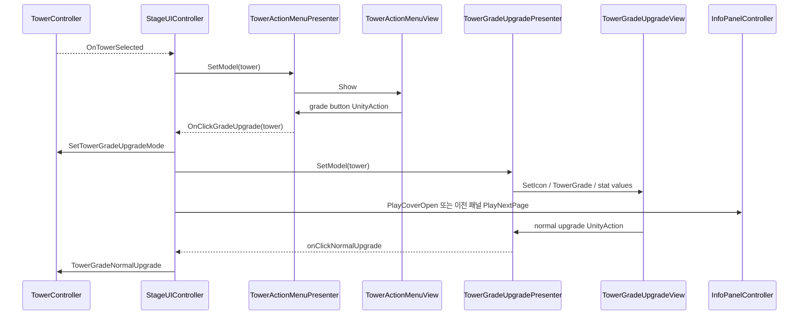

# UI 정보 패널 시스템

## 1. 개요

적, 아이템, 타워 행동, 등급 강화, 스탯 강화, 세션 상태를 동일한 UI 조정 계층에서 표시한다. View는 Unity 컴포넌트 표시, Presenter는 모델 변환, StageUIController는 패널과 게임 시스템 연결을 담당한다.

## 2. 구현 목적

- View가 Tower, Enemy, Save 시스템을 직접 조작하지 않게 한다.
- 동일 화면에서 여러 상세 패널이 겹치거나 전환 중 재입력되는 문제를 제어한다.
- 모델 데이터를 현지화 문자열, 아이콘, 표시 형식으로 변환한다.
- 버튼 입력을 게임 명령 이벤트로 전달한다.
- 런 세션의 변경 값만 UI에 반영한다.

## 3. 해결하려던 문제

단일 MonoBehaviour가 모든 UI 텍스트와 게임 규칙을 처리하면 클래스가 급격히 커지고 테스트가 어렵다. 상세 패널마다 별도 애니메이션 상태를 가지면 빠른 연속 입력 시 Tween과 Animator가 충돌할 수 있으며, 모델 변경을 Update에서 계속 확인하면 불필요한 비용이 발생한다.

## 4. 주요 클래스

| 클래스 | 책임 |
|---|---|
| [StageUIController](../../Assets/02.Scripts/UI/Controllers/Stage/StageUIController.cs) | Presenter 생성, 이벤트 바인딩, 패널 전환, 게임 명령 중재 |
| [InfoPanelController](../../Assets/02.Scripts/UI/Controllers/Stage/InfoPanelController.cs) | CanvasGroup, DOTween, Animator 기반 페이지 전환 |
| [EnemyInfoPresenter](../../Assets/02.Scripts/UI/Presenter/Stage/EnemyInfoPresenter.cs) / [EnemyInfoView](../../Assets/02.Scripts/UI/View/Stage/EnemyInfoView.cs) | 적 스탯·스킬·현지화 표시 |
| [ItemInfoPresenter](../../Assets/02.Scripts/UI/Presenter/Stage/ItemInfoPresenter.cs) / [ItemInfoView](../../Assets/02.Scripts/UI/View/Stage/ItemInfoView.cs) | 아이템 정보와 판매 입력 |
| [TowerActionMenuPresenter](../../Assets/02.Scripts/UI/Presenter/Stage/TowerActionMenuPresenter.cs) / [TowerActionMenuView](../../Assets/02.Scripts/UI/View/Stage/TowerActionMenuView.cs) | 이동·강화·큐 이동 명령 |
| [TowerGradeUpgradePresenter](../../Assets/02.Scripts/UI/Presenter/Stage/TowerGradeUpgradePresenter.cs) / [TowerGradeUpgradeView](../../Assets/02.Scripts/UI/View/Stage/TowerGradeUpgradeView.cs) | 일반·프리미엄 합성과 판매 정보 |
| [TowerStatUpgradePresenter](../../Assets/02.Scripts/UI/Presenter/Stage/TowerStatUpgradePresenter.cs) / [TowerStatUpgradeView](../../Assets/02.Scripts/UI/View/Stage/TowerStatUpgradeView.cs) | 런 스탯 단계·비용 표시와 강화 명령 |
| [SessionInfoPresenter](../../Assets/02.Scripts/UI/Presenter/Stage/SessionInfoPresenter.cs) / [SessionInfoView](../../Assets/02.Scripts/UI/View/Stage/SessionInfoView.cs) | 레벨, EXP, 생명, 웨이브, 남은 적 이벤트 표시 |

## 5. 데이터 흐름



Presenter는 아이콘 경로, 현지화 키, 숫자 포맷을 해석하고 View에는 즉시 표시 가능한 값만 전달한다.

## 6. 이벤트 흐름



SessionInfoPresenter는 RunSessionDataManager 이벤트를 직접 구독하고 화면 종료 시 대칭적으로 해제한다.

## 7. 핵심 구현 방식

### 표시 값 변환과 View 갱신 분리

```csharp
public void SetModel(ItemData model, int index)
{
    Sprite icon = ResourceCache.Load<Sprite>(
        $"Item/Images/{model.iconUID}");
    view.SetIcon(icon);
    view.SetItemName(
        Managers.Local.GetString("Item", model.stringKey));
    view.SetItemPrice(model.salePrice);
}
```

View는 모델 조회 방법을 모르며 SetIcon, SetItemName 같은 표시 API만 제공한다.

### 애니메이션 충돌 방지

InfoPanelController는 새 전환 전에 기존 DOTween Sequence를 Kill한다. CanvasGroup의 interactable과 blocksRaycasts를 전환 단계에 맞춰 제어하고, Animator 이벤트가 끝날 때 완료 콜백을 한 번 실행한 뒤 null로 정리한다.

### 패널 중앙 관리

StageUIController는 currentInfoPanel과 isInfoPanelTransitioning을 사용해 현재 패널과 전환 중 여부를 관리한다. currentInfoPanelType도 기록하지만, 현재 코드에서는 값을 설정하거나 None으로 초기화할 뿐 분기 조건에서 읽는 위치는 확인되지 않았다.

## 8. 설계 방식

### Presenter와 View 책임 분리

Presenter는 도메인 데이터를 현지화된 문자열, 아이콘, 수치 같은 표시 값으로 변환한다. View는 변환된 값을 받아 TextMeshPro, Image, Button 등 Unity UI 컴포넌트를 갱신한다. 이는 특정 UI 패턴을 완전히 구현했다는 선언보다 표시 값 변환과 Unity UI 조작을 서로 다른 책임으로 둔 설계다.

### 입력·표시·전환 책임 분리

View의 버튼 입력은 Presenter를 거쳐 명령 이벤트로 전달되고, `StageUIController`가 이를 타워·아이템 등 게임 시스템의 동작에 연결한다. `InfoPanelController`는 CanvasGroup, DOTween, Animator를 이용한 개별 패널 전환을 담당하며 `StageUIController`는 현재 패널과 전환 중 상태를 확인해 중복 입력을 막는다.

### 상태 변경 시점에만 화면 갱신

세션 정보와 선택 상태는 C# 이벤트로 전달되어 값이 바뀐 시점에 Presenter가 View를 갱신한다. 화면이 매 프레임 도메인 상태를 조회하지 않아도 되고, 화면 종료 시 이벤트 연결을 해제해 재진입 후 중복 호출을 방지한다.

## 9. 문제 해결 과정

상세 패널 전환은 DOTween 이동과 Animator 페이지 효과가 연속으로 실행된다. 새 입력이 기존 Sequence와 겹치지 않도록 활성 Tween을 먼저 종료하고, 애니메이션 완료 콜백을 필드에 보관한 뒤 Animation Event에서 한 번만 실행한다.

다양한 모델의 표시 로직은 Presenter별로 분리했다. EnemyInfoPresenter는 스킬 설명의 포맷 오류를 예외 처리하고 원문으로 폴백해 잘못된 현지화 문자열이 전체 UI를 중단시키지 않게 한다.

## 10. 결과

- 적, 아이템, 타워 관련 상세 정보를 동일한 패널 전환 체계에서 제공한다.
- UI 버튼이 직접 게임 상태를 변경하지 않고 Presenter와 StageUIController를 거친다.
- 런 세션 UI는 상태 이벤트가 발생할 때만 갱신된다.
- 현지화, 아이콘 캐시, 숫자 형식 변환이 Presenter에 모였다.
- OnDestroy에서 주요 이벤트를 해제해 씬 재진입 중복 호출을 방지한다.

## 11. 개선 가능성

- 576줄 규모의 StageUIController를 PanelRouter, Binding, GameplayCommand 영역으로 분리한다.
- Presenter와 View 인터페이스를 도입해 Unity 없이 표시 로직을 테스트한다.
- GetInfoPanelAnimator의 switch 매핑을 Dictionary 또는 설정 데이터로 관리할 수 있다.
- 현재 분기에서 읽히지 않는 currentInfoPanelType의 필요 여부를 확인하고 제거하거나 실제 전환 검증에 사용한다.
- UnityAction 바인딩에도 명시적 Unbind를 추가한다.
- InfoPanelController의 런타임 스크립트에 포함된 불필요한 NUnit.Framework 의존성을 제거한다.
- Resource 경로 문자열을 강타입 Asset ID 또는 Addressables로 전환한다.
- 접근성, 키보드/게임패드 포커스, 해상도별 레이아웃 테스트를 추가한다.

## 12. 포트폴리오에 강조할 점

- 표시 값 변환, Unity UI 갱신, 게임 명령 연결의 책임 분리
- Tween과 Animator를 조합하면서 전환 충돌을 제어한 상태 관리
- 이벤트 기반 세션 UI로 불필요한 폴링 제거
- 현지화 포맷 실패까지 고려한 방어적 Presenter 구현
