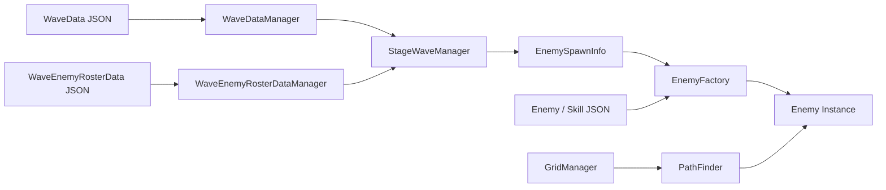
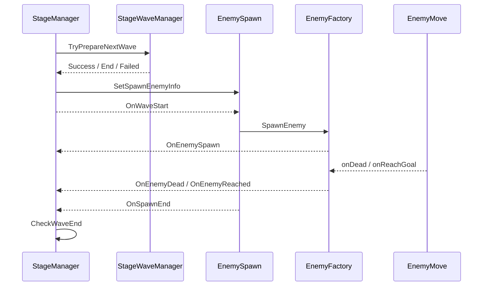

# 웨이브 및 적 시스템

## 1. 개요

난이도별 연결 웨이브를 데이터로 준비하고, 로스터의 적 종류·레벨·수량·시작 시각·간격에 따라 적을 생성한다. 생성된 적은 A* 경로를 따라 이동하며 사망 또는 목표 도착 이벤트로 스테이지 상태를 갱신한다.

## 2. 구현 목적

- 웨이브 구성과 밸런스를 코드에서 분리한다.
- 잘못된 UID나 스폰 값이 전투 중 null 오류로 이어지기 전에 검증한다.
- 적 생성 절차와 스테이지 진행 상태를 분리한다.
- 스폰 완료와 생존 적 제거라는 두 조건을 정확히 합성한다.
- 적 능력과 스킬을 UID·레벨 기반으로 재사용한다.

## 3. 해결하려던 문제

웨이브를 코드에 하드코딩하면 난이도별 콘텐츠 추가 비용이 커진다. 또한 “모든 적 스폰 완료”와 “필드의 모든 적 제거”는 서로 다른 시점에 발생하므로 한 조건만 사용하면 웨이브가 조기 종료되거나 종료되지 않을 수 있다.

## 4. 주요 클래스

| 클래스 | 책임 |
|---|---|
| [StageWaveManager](../../Assets/02.Scripts/Managers/Stage/StageWaveManager.cs) | 다음 웨이브 탐색, 로스터 검증, END 판정 |
| [StageManager](../../Assets/02.Scripts/Managers/Stage/StageManager.cs) | 생존 적 집계, 보상, 생명, 웨이브 전환 |
| [EnemySpawn](../../Assets/02.Scripts/Stage/Enemy/EnemySpawn.cs) | 로스터 변환과 시간 기반 스폰 코루틴 |
| [EnemyFactory](../../Assets/02.Scripts/Stage/Enemy/EnemyFactory.cs) | Enemy 생성, 데이터·이동·스킬 초기화, 이벤트 중계 |
| [Enemy](../../Assets/02.Scripts/Stage/Enemy/Enemy.cs) | HP, Shield, 이동속도 보정, 피격·사망 |
| [EnemyMove](../../Assets/02.Scripts/Stage/Enemy/EnemyMove.cs) | 경로 이동과 목표 도착 |
| [EnemySkill](../../Assets/02.Scripts/Stage/Enemy/EnemySkill.cs) | 적 스킬 쿨다운과 효과 실행 |
| [PathFinder](../../Assets/02.Scripts/Stage/Path/PathFinder.cs) | 4방향 Manhattan 휴리스틱을 사용하는 A* 경로 계산 |
| [TowerAttack](../../Assets/02.Scripts/Tower/TowerAttack.cs) | 사거리 내 유효한 적 탐색과 공격 주기 처리 |
| [WaveDataManager](../../Assets/02.Scripts/Managers/Data/Wave/WaveDataManager.cs) | WaveData JSON을 UID 기준으로 조회 |
| [WaveEnemyRosterDataManager](../../Assets/02.Scripts/Managers/Data/Wave/WaveEnemyRosterDataManager.cs) | 웨이브 UID에 해당하는 적 로스터 목록 조회 |
| [EnemyDataManager](../../Assets/02.Scripts/Managers/Data/Enemy/EnemyDataManager.cs) | 적 기본 데이터 조회 |
| [EnemySkillDataManager](../../Assets/02.Scripts/Managers/Data/Enemy/EnemySkillDataManager.cs) | 적 스킬 데이터 조회 |

## 5. 데이터 흐름



현재 데이터에는 240개 웨이브와 424개 로스터 행이 있으며 웨이브 UID는 NextWave로 연결된다.

## 6. 이벤트 흐름



## 7. 핵심 구현 방식

### 사전 검증

TryPrepareNextWave는 다음 UID, 웨이브 존재 여부, 로스터 존재 여부, 적·스킬 참조, 레벨, 수량, 시작 시간, 스폰 간격을 검사한다. 결과는 Success, End, Failed와 메시지를 가진 WavePrepareResult로 반환한다.

```csharp
if (!ValidateRosterData(wave, roster, out string error))
    return new WavePrepareResult {
        state = WavePrepareState.Failed,
        message = error
    };
```

### 웨이브 종료 판정

isSpawning이 false이고 aliveEnemyCnt가 0일 때만 다음 웨이브로 이동한다. 적 생성, 사망, 도착 이벤트가 각각 카운터를 갱신한 뒤 같은 CheckWaveEnd를 호출한다.

### 경로 탐색

PathFinder는 상하좌우 네 방향, Manhattan 휴리스틱을 사용하는 A*다. 각 EnemyMove 초기화 시 현재 셀에서 목표 셀까지 경로를 계산하고, 셀 중심을 순서대로 이동한다.

### 타겟과 공격

TowerAttack은 기존 타겟이 유효하고 사거리 안이면 유지하고, 필요할 때만 OverlapCircleAll로 가장 가까운 적을 다시 찾는다. 공격 간격은 1 / CurrentAtkSpeed로 계산한다.

## 8. 설계 방식

### 웨이브 진행과 적 생성 책임 분리

`EnemySpawn`은 웨이브 로스터와 스폰 타이밍을 처리하고, `EnemyFactory`는 적 생성, 초기화, 이동 경로 설정, 생명주기 이벤트 연결을 담당한다. 이는 특정 생성 패턴을 완전히 구현했다는 의미보다, 웨이브 흐름이 `Instantiate`와 컴포넌트 초기화 세부사항을 모두 떠안지 않도록 생성 책임을 분리한 구조다.

### 이벤트 기반 생명주기 전달

적 생성, 사망, 목표 도착은 C# 이벤트로 `StageManager`에 전달된다. `EnemyFactory`가 적의 이동 이벤트를 연결해 전달하므로 웨이브 진행 코드는 개별 적을 계속 조회하지 않고 생존 적 수와 제거 수를 갱신할 수 있다.

### 복합 완료 조건 관리

스폰 종료와 필드의 마지막 적 제거는 서로 다른 시점에 발생한다. `StageManager`는 `isSpawning`과 `aliveEnemyCnt`를 함께 확인해 더 생성할 적이 없고 생존 적도 없을 때만 웨이브 완료로 판단한다. 웨이브 준비 결과도 별도 상태로 반환해 데이터 누락과 실행 성공을 구분한다.

## 9. 문제 해결 과정

웨이브 종료를 단순 “스폰 코루틴 종료”로 처리하면 필드에 적이 남아도 다음 웨이브가 준비된다. 반대로 생존 적 수만 검사하면 아직 생성 예정인 적이 없다고 잘못 판단할 수 있다. 두 조건을 별도로 기록하고, 두 이벤트 경로 모두에서 동일한 종료 검사를 호출해 해결했다.

데이터 누락은 런타임 생성 중 처리하지 않고 웨이브 준비 단계에서 차단한다. 실패 시 적 생성을 중지하고 StageManager가 오류 상태로 전환한다.

## 10. 결과

- 난이도별 웨이브를 UID 연결 구조로 구성했다.
- 적 종류, 레벨, 수량, 시간표를 JSON에서 변경할 수 있다.
- 데이터 오류를 웨이브 시작 전에 구체적인 메시지로 탐지한다.
- 적 사망은 골드 지급, 전체·웨이브 킬 카운트 증가, 생존 적 수 감소로 연결된다.
- 목표 도착은 생존 적 수와 플레이어 생명 감소로 연결된다.
- EnemyData와 현재 13개 EnemySkillData 행을 공통 EnemyFactory 생성 흐름에서 사용한다.

## 11. 개선 가능성

- 현재 적 그룹 코루틴은 각 그룹 종료를 기다린 뒤 다음 그룹을 실행한다. startTime이 겹치는 그룹을 지원하려면 그룹별 독립 코루틴과 완료 카운터가 필요하다.
- Enemy를 풀링해 반복 Instantiate/Destroy 비용을 줄인다.
- 동일한 시작 셀과 목표 셀 조합의 경로를 캐시해 반복되는 A* 계산을 줄일 수 있다. 소환 적처럼 시작 셀이 다른 경우는 별도 키가 필요하다.
- A* openList의 선형 최소값 탐색을 PriorityQueue로 변경한다.
- TowerAttack의 OverlapCircleAll을 NonAlloc 또는 중앙 적 인덱스로 대체한다.
- 전투 루프의 Debug.Log를 개발 빌드 조건으로 제한한다.
- 마지막 웨이브의 보상 지급 시점이 스테이지 종료보다 앞서야 하는지 기획 의도를 명시한다.

## 12. 포트폴리오에 강조할 점

- 240개 웨이브를 코드와 분리한 데이터 기반 파이프라인
- 스폰 완료 여부와 생존 적 수를 함께 검사하는 웨이브 종료 조건
- 웨이브 참조와 적 스킬까지 포함한 사전 무결성 검증
- EnemyFactory, WavePrepareResult, C# 이벤트를 이용한 적 생명주기 처리
- 병목 지점을 코드 수준에서 파악하고 구체적인 최적화 순서를 제시할 수 있음
