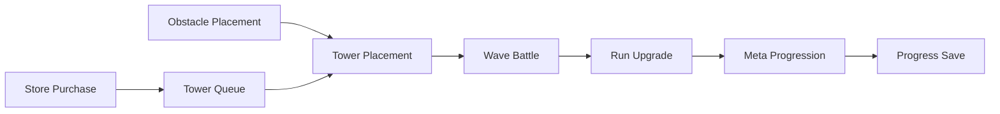
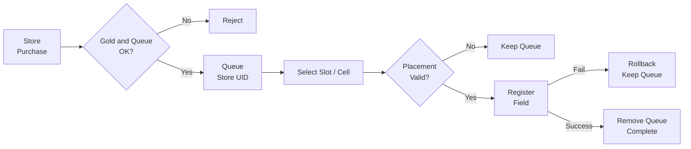
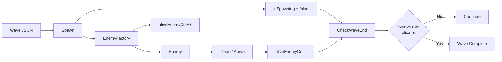

# RandomTowerDefence

> Unity 6 기반 2D 타워 디펜스 포트폴리오 프로젝트

플레이어가 그리드에 장애물을 설치해 타워 배치 기반을 만들고, 상점에서 구매한 타워를 대기열에 보관한 뒤 장애물 셀 위에 배치하는 게임입니다. 웨이브와 적 로스터는 JSON 데이터로 관리하며, 전투 중 적용되는 런 강화와 계정 단위 메타 성장을 분리했습니다. 기기별 옵션은 로컬 JSON으로, 계정 진행 데이터는 Firebase Firestore로 저장합니다. 주요 기능 구현을 마치고 시스템 구조와 문제 해결 과정을 기술 문서로 정리했습니다.

## Preview

핵심 플레이 흐름을 빠르게 확인할 수 있도록 영상과 GIF, 주요 화면 이미지를 준비할 예정입니다. 현재 공개 자료의 준비 현황은 다음과 같습니다.

| 구분 | 내용 | 상태 |
|---|---|---|
| Gameplay Video | 30초 플레이 영상 | TODO |
| Build Flow GIF | 상점 → 대기열 → 타워 설치 | TODO |
| Wave Battle GIF | 웨이브 전투 흐름 | TODO |
| Meta Growth GIF | 메타 성장 UI | TODO |
| Screenshots | 주요 화면 스크린샷 | TODO |

<!-- 플레이 영상 또는 대표 GIF를 이 위치에 추가 -->

## Project Info

| 항목 | 내용 |
|---|---|
| 장르 | 2D Tower Defense |
| 엔진 | Unity 6 |
| 언어 | C# |
| 개발 인원 | 1인 개발 |
| 개발 기간 | 2026.04.13 ~ 2026.06.26 |
| 대상 플랫폼 | PC / Steam 배포 목표 |
| 개발 상태 | 주요 기능 구현 완료, 포트폴리오 문서화 진행 |

## My Role

1인 개발 기준으로 전체 구현을 담당했습니다.

- 전체 프로그래밍
- 시스템 설계
- UI 구현
- 데이터 구조 설계
- 저장·불러오기 구현
- Unity Editor Tooling 작성
- 기술 문서 작성

## Core Gameplay Flow

장애물 설치와 상점 구매·대기열 보관은 각각 타워 배치를 준비하는 흐름입니다. 두 조건이 갖춰지면 장애물 셀에 타워를 배치하고, 웨이브 전투에서 획득한 자원을 런 강화와 계정 메타 성장으로 연결합니다.

## Key Features

> **Design Visuals**
>
> - TODO: Save & Load 데이터 흐름 다이어그램 추가
> - TODO: Editor Tooling 화면 캡처 추가

### 1. Tower Build System

구매한 타워는 즉시 필드에 생성되지 않고 UID가 큐에 저장된다. 실제 설치 시점에 큐 선택, 셀과 장애물, 기존 타워 점유, 필드 등록 결과를 검증하고 성공한 경우에만 큐를 갱신한다.

- **문제:** 구매 상태와 실제 필드 설치 상태가 분리되어 있어 설치 시점의 검증과 실패 처리가 필요했다.
- **설계:** TowerController가 큐 슬롯과 UID, 그리드 범위, 시작·도착 셀, 장애물, 기존 타워, 최대 설치 수를 검사한 뒤 FieldTowerManager에 등록한다.
- **이점:** 설치나 필드 등록이 실패하면 큐를 유지하고, 등록 성공 시에만 큐를 제거해 두 상태의 갱신 기준을 맞췄다.
- **주요 클래스 흐름:** **StoreController → QueueUIController → TowerController → FieldTowerManager**
- **상세 문서:** [BuildSystem](Docs/Systems/BuildSystem.md)

### 2. Shop & Queue System

상점 구매와 그리드 배치를 분리하고 QueueUIController가 슬롯별 타워 UID를 보관한다. 구매 흐름은 골드 사용 가능 여부와 큐 수용 결과를 확인하며, 큐가 가득 차면 차감한 골드를 환불하고 구매를 확정하지 않는다.

- **문제:** 구매와 설치를 한 단계로 처리하면 상점 UI가 그리드와 생성 규칙까지 알아야 하고, 큐 수용 실패 시 골드만 차감될 수 있었다.
- **설계:** StoreController가 결제 결과와 QueueUIController.AddTower 반환값을 처리하고, 큐는 이후 설치 요청 이벤트만 발행한다.
- **이점:** 큐에 공간이 없는 구매와 필드 설치 실패를 서로 다른 단계에서 처리할 수 있다.
- **주요 클래스 흐름:** **StoreController → StageManager.UsingGold → RunSessionDataManager → QueueUIController**
- **상세 문서:** [ShopAndQueueSystem](Docs/Systems/ShopAndQueueSystem.md)

### 3. Wave & Enemy System

WaveData와 WaveEnemyRosterData JSON을 준비 단계에서 검증한 뒤 EnemySpawn과 EnemyFactory가 적 생성과 초기화를 담당한다. 스폰 완료와 필드의 마지막 적 제거가 다른 시점에 발생하므로 두 상태를 함께 사용해 완료를 판단한다.

- **문제:** 스폰 종료만 확인하면 적이 남은 채 웨이브가 끝날 수 있고, 생존 적 수만 확인하면 생성 예정 적을 놓칠 수 있었다.
- **설계:** isSpawning과 aliveEnemyCnt를 별도로 기록하고 스폰 종료, 적 사망, 목표 도착 시 같은 CheckWaveEnd를 호출한다.
- **이점:** 스폰이 끝나고 생존 적이 없는 경우에만 다음 웨이브 또는 스테이지 종료 흐름으로 이동한다.
- **주요 클래스 흐름:** **StageManager → StageWaveManager → EnemySpawn → EnemyFactory → Enemy**
- **상세 문서:** [WaveAndEnemySystem](Docs/Systems/WaveAndEnemySystem.md)

### 4. Meta Upgrade System

전투 중에만 유지되는 런 강화와 계정에 저장되는 메타 성장은 수명주기가 다르다. 영구 강화가 적용된 기본값에 현재 런의 일반·아이템·스킬 강화 단계를 더해 최종 타워 스탯을 계산한다.

- **문제:** 영구 성장과 런 성장을 원본 TowerData나 UI에서 직접 합산하면 저장 상태와 실제 전투 값이 어긋날 수 있었다.
- **설계:** TowerMetaUpgradeManager가 영구 레벨을 보관하고 GameManager가 기본값과 메타 값을 결합하며 TowerStatCalculator가 RunStatUpgradeManager의 현재 런 단계를 합성한다.
- **이점:** 원본 밸런스 데이터를 변경하지 않고 계정 성장과 런 상태를 독립적으로 저장·초기화할 수 있다.
- **주요 클래스 흐름:** **TowerMetaUpgradeManager → GameManager.GetTowerDisplayData → TowerStatCalculator ← RunStatUpgradeManager**
- **상세 문서:** [MetaUpgradeSystem](Docs/Systems/MetaUpgradeSystem.md)

### 5. Save & Load System

기기별 입력·사운드·그래픽 옵션과 계정 진행 데이터는 저장 목적과 수명주기가 다르다. 옵션은 로컬 JSON으로, Player·Meta·Quest 진행은 Firebase Firestore로 나눠 저장한다.

- **문제:** 원격 문서 없음과 네트워크·권한·시간 초과·손상 데이터를 같은 실패로 처리하면 초기화와 복구 기준이 불명확해진다.
- **설계:** FirestoreSaveRepository가 로드 결과를 상태로 변환하고 IValidSaveData가 역직렬화된 모델을 검증하며, SaveDataManager가 영역별 dirty flag를 관리한다.
- **이점:** 신규 사용자 기본 데이터 생성과 실제 로드 실패를 구분하고 변경된 원격 저장 영역만 기록한다.
- **주요 클래스 흐름:** **Managers → SaveDataManager → FirestoreSaveRepository → Firebase Firestore / SaveDataManager → Local JSON**
- **상세 문서:** [SaveLoadSystem](Docs/Systems/SaveLoadSystem.md)

### 6. Quest & Achievement System

ScriptableObject는 퀘스트와 업적의 원본 정의로 사용하고, 플레이 중 진행도는 복제한 런타임 객체가 보유한다. 게임 시스템은 카테고리, 대상, 횟수를 공통 Report API로 전달한다.

- **문제:** 원본 에셋에 진행도를 기록하거나 게임 시스템이 개별 업적을 직접 호출하면 상태 공유와 콘텐츠 추가 의존성이 생길 수 있었다.
- **설계:** QuestManager가 보고를 분배하고 QuestTaskData가 TaskTarget과 QuestCondition을 통해 대상과 활성 조건을 판정한다.
- **이점:** 원본 에셋을 변경하지 않으면서 완료 이벤트, 보상, Achievement 저장 흐름을 공통 구조로 처리한다.
- **주요 클래스 흐름:** **QuestManager → Quest / Achievement → QuestTaskData → TaskTarget / QuestCondition**
- **상세 문서:** [QuestSystem](Docs/Systems/QuestSystem.md)

### 7. UI Info Panel System

Presenter가 도메인 모델을 문자열·아이콘·수치 같은 표시 값으로 변환하고 View가 TextMeshPro, Image, Button 등 Unity UI를 갱신한다. StageUIController와 InfoPanelController가 입력 전달과 패널 전환 상태를 관리한다.

- **문제:** View가 게임 규칙과 모델 조회까지 담당하면 패널별 책임이 커지고 연속 입력 시 Tween과 Animator 전환이 겹칠 수 있었다.
- **설계:** Presenter/View를 분리하고 StageUIController가 게임 시스템 명령과 이벤트를 연결하며 InfoPanelController가 전환 중 입력 상태를 제어한다.
- **이점:** 표시 변환, Unity UI 조작, 게임 명령의 위치가 분리되고 주요 이벤트를 화면 수명주기에 맞춰 해제할 수 있다.
- **주요 클래스 흐름:** **Gameplay System ↔ StageUIController ↔ Presenter ↔ View / StageUIController → InfoPanelController**
- **상세 문서:** [UIInfoPanelSystem](Docs/Systems/UIInfoPanelSystem.md)

### 8. Editor Tooling

반복적인 JSON 편집, ScriptableObject 생성, 검증, Play Mode 테스트를 Unity Editor 안에서 처리하도록 전용 도구를 구성했다. 런타임 코드를 변경하지 않고 제작 데이터와 테스트 대상을 다룬다.

- **문제:** Tower, Enemy, Item, Wave, Quest 데이터를 직접 편집하면 UID, enum, 참조, 수치 입력을 반복해서 확인해야 했다.
- **설계:** 테이블 EditorWindow와 Validate 탭, Quest/Achievement 제작 창, Custom Inspector 디버거, ConditionalFieldDrawer를 작성했다.
- **이점:** 데이터 편집과 검증, 에셋 생성, 테스트 입력을 Unity Editor 안에서 수행할 수 있다.
- **주요 클래스 흐름:** **EditorWindow / CustomEditor / CustomPropertyDrawer → JSON / ScriptableObject / Runtime Debug Target**
- **상세 문서:** [EditorTooling](Docs/Systems/EditorTooling.md)

## Technical Highlights

- **Data-Driven Design:** Tower, Enemy, Item, Wave, Meta 데이터를 JSON으로 관리
- **Event-Driven Flow:** 전투, UI, 퀘스트, 세션 상태를 C# 이벤트로 연결
- **Runtime / Persistent Data Separation:** 스테이지 런 상태와 계정 진행 데이터를 분리
- **Firebase Save Pipeline:** Firestore 로드 결과를 문서 없음, 네트워크, 권한, 시간 초과, 데이터 손상 상태로 구분
- **Presenter / View Structure:** 표시 값 변환과 Unity UI 조작 책임을 분리
- **Editor Tooling:** 데이터 테이블, 퀘스트 에셋, Inspector, Play Mode 디버깅 작업을 Editor 확장으로 보조

## Problem Solving

Key Features 전반에서 반복된 설계 판단은 세 가지다.

- **부분 성공 상태 관리:** 결제, 큐 저장, GameObject 생성, 필드 등록을 각각 확인하고 성공한 단계에 맞춰 환불·유지·제거를 결정했다.
- **복합 완료 조건:** 웨이브는 단일 이벤트가 아니라 스폰 상태와 생존 적 수의 현재값을 함께 검사한다.
- **외부 데이터 실패 구분:** Firestore 결과와 저장 모델 검증을 분리해 신규 사용자 초기화와 실제 오류 대응의 경계를 정했다.

자세한 문제 정의, 선택한 전략, 처리 순서는 [Case Study](Docs/Portfolio/CaseStudy.md)에서 확인할 수 있다.

## Tech Stack

| 기술 | 사용 목적 |
|---|---|
| Unity 6 | 2D 게임 클라이언트와 Unity Editor 확장 구현 |
| C# | 게임 로직, UI, 저장 흐름, Editor Tooling |
| Firebase Authentication / Firestore | 사용자 인증과 계정 진행 데이터 저장 |
| JSON | 정적 게임 데이터와 로컬 옵션 저장 |
| Unity UI / TextMeshPro | 게임 UI, 입력 컴포넌트, 정보 패널 |
| DOTween | UI 이동과 패널 전환 Sequence |
| ScriptableObject | 퀘스트·업적 원본 데이터 |
| Unity Editor Extension | 데이터 제작, 검증, Custom Inspector와 디버깅 도구 |

## Third-party Assets / Resources

| Asset / Resource | Source | Usage | License / Note |
|---|---|---|---|
| TODO | TODO | TODO | TODO: 라이선스 확인 필요 |

> 사용 에셋의 출처와 라이선스는 공개 전 정리할 예정입니다.

## Documentation

### Portfolio

- [기술 문서 메인](Docs/README.md)
- [프로젝트 요약](Docs/Portfolio/ProjectSummary.md)
- [케이스 스터디](Docs/Portfolio/CaseStudy.md)
- [면접 예상 질문](Docs/Portfolio/InterviewQA.md)
- [프로젝트 회고](Docs/Postmortem.md)

### Architecture

- [시스템 아키텍처](Docs/Architecture/SystemArchitecture.md)
- [이벤트 흐름](Docs/Architecture/EventFlow.md)
- [데이터 흐름](Docs/Architecture/DataFlow.md)

### Systems

- [타워 건설 시스템](Docs/Systems/BuildSystem.md)
- [상점 및 대기열 시스템](Docs/Systems/ShopAndQueueSystem.md)
- [웨이브 및 적 시스템](Docs/Systems/WaveAndEnemySystem.md)
- [메타 성장 시스템](Docs/Systems/MetaUpgradeSystem.md)
- [저장 및 불러오기 시스템](Docs/Systems/SaveLoadSystem.md)
- [퀘스트 및 업적 시스템](Docs/Systems/QuestSystem.md)
- [UI 정보 패널 시스템](Docs/Systems/UIInfoPanelSystem.md)
- [Editor Tooling](Docs/Systems/EditorTooling.md)

## Current Limitations / Future Improvements

- 플레이 영상, GIF, 주요 화면 스크린샷 추가 필요
- Unity Profiler 기반 생성·파괴, 경로 탐색, 타겟 탐색 비용 측정
- 건설, 큐 상태, 웨이브 종료, 저장 검증 규칙의 자동화 테스트 보강
- 저장 데이터 schemaVersion과 마이그레이션 정책 검토
- StageManager와 TowerController에 집중된 조정 책임 분리 검토
- Editor Tool의 공통 편집 기반과 통합 검증 리포트 검토

## Contact

- GitHub: [limrum09](https://github.com/limrum09)
- Portfolio Site: TODO
