# RandomTowerDefence

> Unity 6 기반 2D 타워 디펜스 포트폴리오 프로젝트

플레이어가 그리드에 장애물을 설치해 타워 배치 기반을 만들고, 상점에서 구매한 타워를 대기열에 보관한 뒤 장애물 셀 위에 배치하는 게임입니다. 웨이브와 적 로스터는 JSON 데이터로 관리하며, 전투 중 적용되는 런 강화와 계정 단위 메타 성장을 분리했습니다. 기기별 옵션은 로컬 JSON으로, 계정 진행 데이터는 Firebase Firestore로 저장합니다. 주요 기능 구현을 마치고 시스템 구조와 문제 해결 과정을 기술 문서로 정리했습니다.

## Preview

상점 구매, 타워 설치, 웨이브 전투, 메타 성장, Editor Tooling 흐름을 이미지 중심으로 정리했다.

| Build Flow | Wave Battle |
|---|---|
| 상점 → 대기열 → 타워 설치 | 웨이브 스폰 → 전투 |
| <a href="Docs/Media/Build_Tower.gif">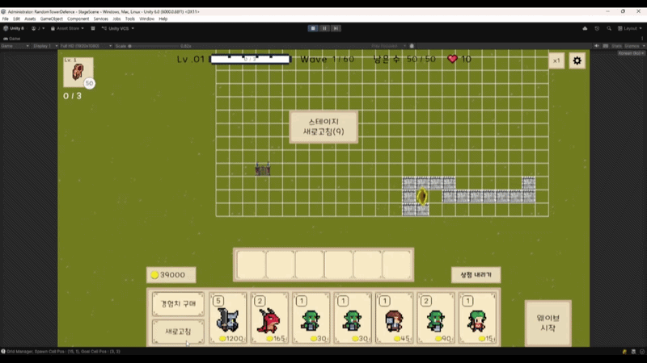</a> | <a href="Docs/Media/Wave_Enemy.gif">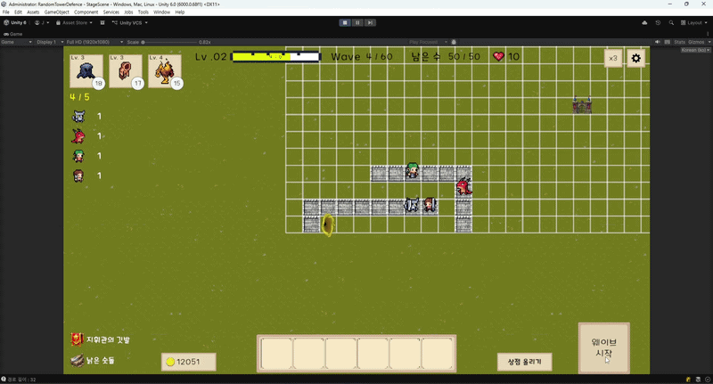</a> |

| Meta Growth | Editor Tooling |
|---|---|
| 메타 성장 UI | Quest Editor |
| <a href="Docs/Media/Meta_Upgrade.gif">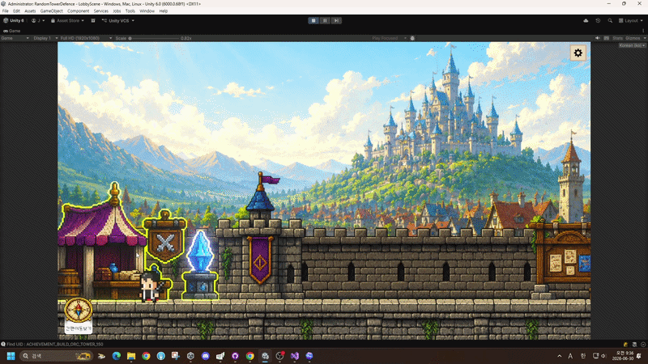</a> | <a href="#9-editor-tooling">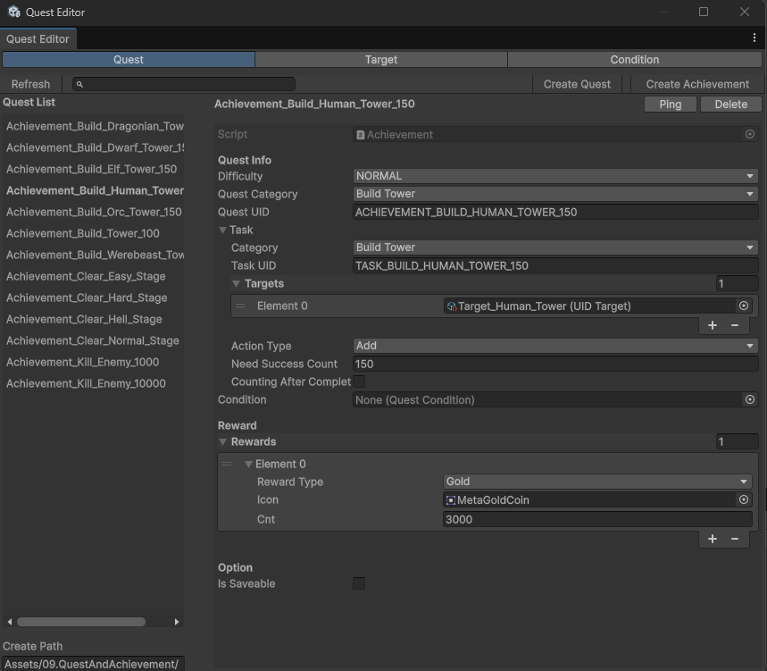</a> |

| Achievement UI | Achievement Debugger |
|---|---|
| 업적 진행 현황 | 진행도 디버깅 |
| <a href="Docs/Images/Achievement_Active.png">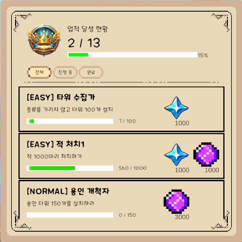</a> | <a href="Docs/Images/Quest_Debugger.png">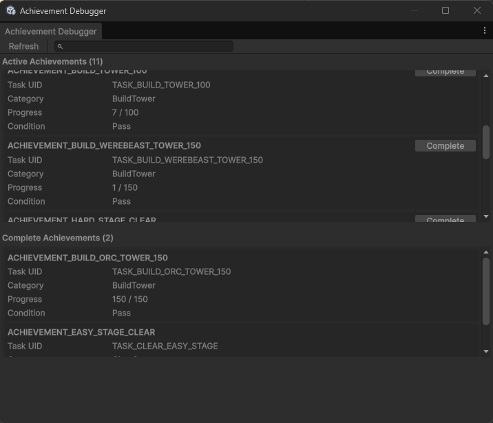</a> |

<!-- 플레이 영상이 준비되면 Preview 첫 행에 추가 -->

## Project Info

| 항목 | 내용 |
|---|---|
| 장르 | 2D Tower Defense |
| 엔진 | Unity 6 |
| 언어 | C# |
| 개발 인원 | 1인 개발 |
| 개발 기간 | 2026.04.13 ~ 2026.06.26 |
| 대상 플랫폼 | PC / Steam 배포 목표 |
| 개발 상태 | 주요 기능 구현 완료, 포트폴리오 문서화 진행 |

## My Role

1인 개발 기준으로 전체 구현을 담당했다.

- 전체 프로그래밍
- 시스템 설계
- UI 구현
- 데이터 구조 설계
- 저장·불러오기 구현
- Unity Editor Tooling 작성
- 기술 문서 작성

### Implementation Direction

이 프로젝트는 기능을 한 번에 처리하기보다, 데이터와 상태가 바뀌는 지점을 나누는 방향으로 구현했다.
타워, 적, 웨이브, 메타 성장 데이터는 JSON으로 관리해 코드와 콘텐츠 값을 분리했고, 전투 중에만 유지되는 값과 계정에 저장되는 값을 따로 관리했다.

게임플레이 흐름에서는 구매, 대기열 보관, 필드 설치, 웨이브 진행, 퀘스트 보고처럼 서로 다른 단계의 상태가 섞이지 않도록 했다.
적 사망, 목표 도착, UI 갱신, 퀘스트 진행처럼 여러 시스템이 반응해야 하는 지점은 C# event로 전달하고, 경로 검증·타워 등록·저장 접근·UI 표시 변환 같은 책임은 각각의 시스템 안에서 처리하도록 구성했다.

## Core Implementation Summary

| 구현 영역 | 요약 |
|---|---|
| Grid & Path Validation | A*로 Spawn–Goal 경로를 검증하고 장애물 설치 가능 여부를 판단 |
| Tower Build | 대기열에 저장된 타워 UID를 실제 필드 타워로 생성하고 등록 성공 시에만 대기열 제거 요청 |
| Shop & Queue | 상점 구매, 골드 처리, 대기열 수용 여부, 타워 UID 보관 상태를 관리 |
| Wave & Enemy | JSON 웨이브 로스터 기반 스폰과 이벤트 기반 웨이브 완료 판정 |
| Meta Upgrade | 전투 중 런 강화와 계정 단위 메타 성장을 분리해 최종 스탯 계산 |
| Save & Load | 로컬 옵션과 Firebase Firestore 계정 진행 데이터를 분리 저장하고 로드 결과 상태를 구분 |
| Quest & Achievement | 컴포넌트 보고와 직접 Report API를 공통 진행·완료 흐름으로 처리 |
| UI Info Panel | 표시 값 변환, Unity UI 갱신, 입력 전달, 패널 전환 책임을 분리 |
| Editor Tooling | JSON과 ScriptableObject 데이터를 Unity Editor에서 제작·검증 |

## Core Gameplay Flow

장애물 설치와 상점 구매·대기열 보관은 각각 타워 배치를 준비하는 흐름이다. 두 조건이 갖춰지면 장애물 셀에 타워를 배치하고, 웨이브 전투에서 획득한 자원을 런 강화와 계정 메타 성장으로 연결한다.

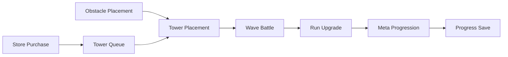

## System Overview

플레이 진행은 스테이지 범위의 런타임 시스템이 역할별로 연결되어 처리된다. 콘텐츠 원본과 저장 데이터는 JSON, ScriptableObject, 로컬 JSON, Firebase Firestore로 구분하며, 아래 도식은 주요 시스템 연결 관계를 README 수준으로 압축한 것이다.

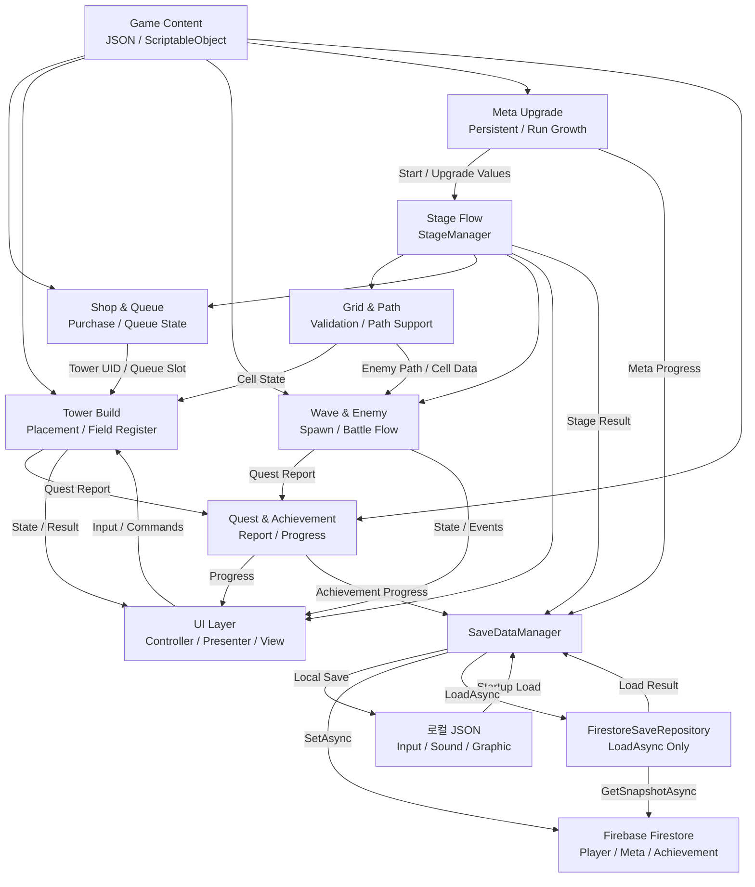

데이터 제작과 검증 흐름은 [EditorTooling](Docs/Systems/EditorTooling.md)에서 별도로 다룬다.

자세한 구조는 [SystemArchitecture](Docs/Architecture/SystemArchitecture.md), [EventFlow](Docs/Architecture/EventFlow.md), [DataFlow](Docs/Architecture/DataFlow.md)에서 확인할 수 있다.

## Key Features

### 1. Grid & Path Validation System

장애물 설치 전에 A*로 Spawn–Goal 경로를 확인하고, 타워 배치와 적 이동이 같은 Grid 좌표계를 사용하도록 구성했다.

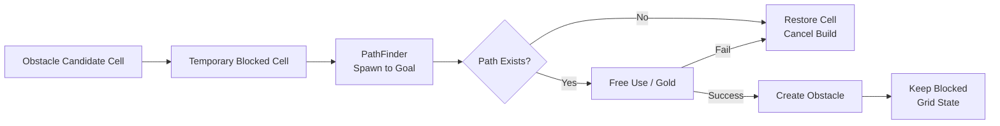

- **문제:** 장애물을 자유롭게 설치하면 적의 Spawn–Goal 경로가 막힐 수 있고, 배치와 이동이 서로 다른 좌표 기준을 사용하면 셀 점유 상태가 어긋날 수 있었다.
- **설계:** `GridManager`가 월드 좌표와 셀 좌표, Spawn·Goal, blocked 셀 상태를 관리한다. `ObstacleBuilder`는 후보 셀을 임시로 차단한 뒤 `PathFinder`로 Spawn에서 Goal까지의 경로를 검사하고, 경로가 없으면 차단 상태를 원복하고 장애물을 생성하지 않는다.
- **이점:** 유효한 이동 경로를 남긴 장애물만 설치할 수 있고, 타워 배치와 적 이동이 동일한 셀 좌표계를 공유한다.
- **주요 클래스:** **GridManager / GridNode / PathFinder / ObstacleBuilder / EnemyMove / TowerController / FieldTowerManager**
- **상세 문서:** [GridPathValidationSystem](Docs/Systems/GridPathValidationSystem.md)

### 2. Tower Build System

대기열에 저장된 타워 UID를 선택한 셀에 실제 타워로 생성하고, 설치 조건과 필드 등록 결과가 유효한 경우에만 대기열 제거를 요청한다.

  

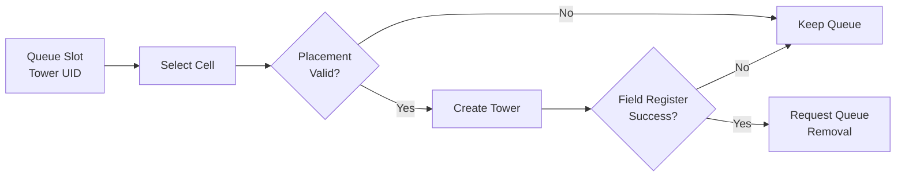

- **문제:** 대기열의 타워 UID를 GameObject와 필드 점유 상태로 전환하는 과정에서 설치 또는 등록이 실패해도 대기열 데이터는 유지되어야 했다.
- **설계:** `TowerController`는 대기열 슬롯과 타워 UID를 받은 뒤 Grid & Path 시스템이 제공하는 셀·장애물 상태에 기존 타워 점유 여부와 최대 설치 수를 결합해 최종 설치 가능 여부를 판단한다. 생성된 타워는 `FieldTowerManager`에 등록하고, 등록 성공 시에만 대기열 제거를 요청한다.
- **이점:** 설치나 필드 등록이 실패하면 대기열 상태를 유지하고, 등록 성공 시에만 대기열에서 제거해 구매 상태·대기열 상태·필드 상태가 어긋나지 않게 한다.
- **주요 클래스 흐름:** **QueueUIController → TowerController → FieldTowerManager → 설치 성공 통지 → QueueUIController**
- **상세 문서:** [BuildSystem](Docs/Systems/BuildSystem.md)

### 3. Shop & Queue System

상점 상품과 구매 조건을 처리하고, 구매한 타워 UID를 대기열 슬롯에 보관해 이후 Tower Build System으로 설치 요청을 전달한다.

- **문제:** 구매와 설치를 한 단계로 처리하면 상점 UI가 필드 규칙까지 알아야 하고, 슬롯 수용에 실패했을 때 골드와 대기열 상태가 어긋날 수 있었다.
- **설계:** `StoreController`는 상품 표시, 리롤, 골드 확인과 구매 처리를 담당하고, `QueueUIController`는 타워 UID와 슬롯 상태를 관리한다. 대기열은 설치 요청을 전달하고, Tower Build System에서 설치 성공 통지를 받은 뒤 해당 슬롯을 비운다.
- **이점:** 수용 실패 시 차감한 골드를 원복해 대기열과 골드 상태를 맞추고, 구매 실패와 설치 실패를 서로 다른 단계에서 처리하며 상점 UI가 배치·필드 등록 규칙을 알지 않게 한다.
- **주요 클래스 흐름:** **StoreController → StageManager.UsingGold / QueueUIController → Tower Build System**
- **상세 문서:** [ShopAndQueueSystem](Docs/Systems/ShopAndQueueSystem.md)

### 4. Wave & Enemy System

WaveData와 WaveEnemyRosterData JSON을 준비 단계에서 검증한다. `EnemySpawn`은 웨이브 로스터와 스폰 타이밍을 처리하고, `EnemyFactory`는 적 생성·초기화와 생명주기 이벤트 연결을 담당한다.

  

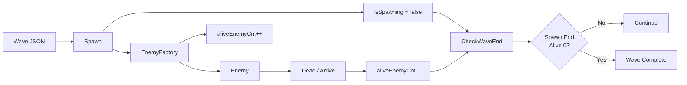

- **문제:** 스폰 종료만 확인하면 적이 남은 채 웨이브가 끝날 수 있고, 생존 적 수만 확인하면 생성 예정 적을 놓칠 수 있었다.
- **설계:** 적 사망과 목표 도착을 C# event로 전달해 생존 적 수를 갱신하고, `isSpawning`과 `aliveEnemyCnt`를 별도로 기록해 스폰 종료와 적 제거 시 같은 `CheckWaveEnd`를 호출한다.
- **이점:** 스폰이 끝나고 생존 적이 없는 경우에만 다음 웨이브 또는 스테이지 종료 흐름으로 이동한다.
- **주요 클래스 흐름:** **StageManager → StageWaveManager → EnemySpawn → EnemyFactory → Enemy**
- **상세 문서:** [WaveAndEnemySystem](Docs/Systems/WaveAndEnemySystem.md)

### 5. Meta Upgrade System

전투 중에만 유지되는 런 강화와 계정에 저장되는 메타 성장은 수명주기가 다르다. 영구 강화가 적용된 기본값에 현재 런의 일반·아이템·스킬 강화 단계를 더해 최종 타워 스탯을 계산한다.

  

- **문제:** 메타 성장과 런 강화를 원본 TowerData나 UI에서 직접 합산하면 저장 상태와 실제 전투 값이 어긋날 수 있었다.
- **설계:** 전투 중에만 유지되는 런 강화와 계정에 저장되는 메타 성장을 별도 상태로 두고, `TowerMetaUpgradeManager`의 영구 레벨과 `RunStatUpgradeManager`의 현재 런 단계를 계산 과정에서 기본값에 합산한다.
- **이점:** 원본 밸런스 데이터를 변경하지 않고 계정 성장과 런 상태를 독립적으로 저장·초기화할 수 있다.
- **주요 클래스 흐름:** **TowerMetaUpgradeManager → GameManager.GetTowerDisplayData → TowerStatCalculator ← RunStatUpgradeManager**
- **상세 문서:** [MetaUpgradeSystem](Docs/Systems/MetaUpgradeSystem.md)

### 6. Save & Load System

기기별 입력·사운드·그래픽 옵션과 계정 진행 데이터는 저장 목적과 수명주기가 다르다. 옵션은 로컬 JSON으로, Player·Meta·Achievement 진행은 `users/{uid}/save` 아래 Firebase Firestore 문서로 나눠 저장한다.

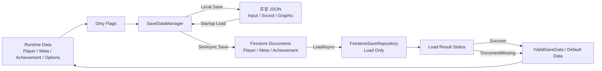

- **문제:** 원격 문서 없음과 네트워크·권한·시간 초과·손상 데이터를 같은 실패로 처리하면 초기화와 복구 기준이 불명확해진다.
- **설계:** 원격 저장은 `SaveDataManager`가 Firebase Firestore `SetAsync`로 처리하고, 원격 로드는 `FirestoreSaveRepository.LoadAsync`로 분리한다. 로드 결과를 상태값으로 구분하고 `IValidSaveData`로 원격 모델을 검증하며, `SaveDataManager`는 영역별 dirty flag를 관리한다.
- **이점:** 신규 사용자 기본 데이터 생성과 실제 로드 실패를 구분하고 변경된 원격 저장 영역만 기록한다.
- **주요 클래스 흐름:** **Managers → SaveDataManager → 로컬 JSON / Firebase Firestore SetAsync / FirestoreSaveRepository LoadAsync**
- **상세 문서:** [SaveLoadSystem](Docs/Systems/SaveLoadSystem.md)

### 7. Quest & Achievement System

ScriptableObject는 퀘스트와 업적의 원본 정의로 사용하고, 플레이 중 진행도는 복제한 런타임 객체가 보유한다. 적 처치·아이템 획득·타워 업그레이드 같은 오브젝트 상태 변화는 `QuestReporter` 컴포넌트로, 특정 오브젝트에 묶기 어려운 조건은 코드에서 직접 공통 Report API로 전달한다.

인게임 업적 UI에서는 전체 달성률과 진행·완료 상태를 확인할 수 있고, Achievement Debugger에서는 런타임 진행도와 조건 판정 결과를 Play Mode에서 확인한다.

| Active Achievement UI | Completed Achievement UI | Achievement Debugger |
|---|---|---|
|  | 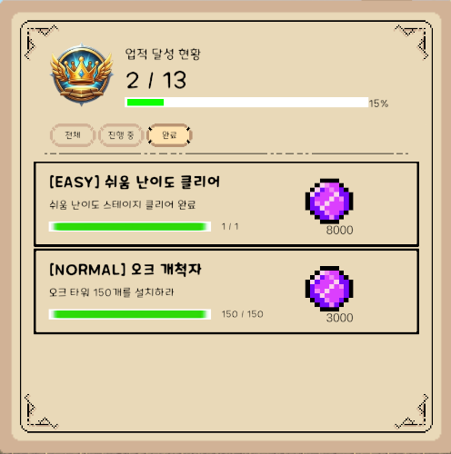 |  |

- **문제:** 원본 에셋에 진행도를 기록하거나 게임 시스템이 개별 업적을 직접 호출하면 상태 공유와 콘텐츠 추가 의존성이 생길 수 있었다.
- **설계:** Enemy, Item, Tower 등에 붙일 수 있는 `QuestReporter`는 Inspector의 `Category`, `Target`, `Success Count`, `Target Tags` 설정을 사용한다. `KillEnemy`는 Enemy가 체력 0 이하로 Dead 처리될 때 보고하고, `ClearStage`는 `StageManager`가 직접 보고한다. 이후 `QuestManager`가 보고를 분배하고 `QuestTaskData`, `TaskTarget`, `QuestCondition`이 조건을 판정한다.
- **이점:** 원본 에셋을 변경하거나 게임 오브젝트가 개별 퀘스트를 참조하지 않고도, 컴포넌트 기반 보고와 코드 직접 보고를 같은 진행·완료·저장 흐름으로 처리한다.
- **주요 클래스 흐름:** **QuestReporter / Gameplay System → QuestManager → Quest / Achievement → QuestTaskData → TaskTarget / QuestCondition**
- **상세 문서:** [QuestSystem](Docs/Systems/QuestSystem.md)

### 8. UI Info Panel System

Presenter가 도메인 모델을 문자열·아이콘·수치 같은 표시 값으로 변환하고 View가 TextMeshPro, Image, Button 등 Unity UI를 갱신한다. StageUIController와 InfoPanelController가 입력 전달과 패널 전환 상태를 관리한다.

- **문제:** View가 게임 규칙과 모델 조회까지 담당하면 패널별 책임이 커지고 연속 입력 시 Tween과 Animator 전환이 겹칠 수 있었다.
- **설계:** Presenter / View 책임을 분리해 Presenter는 도메인 데이터를 표시 값으로 변환하고 View는 Unity UI 컴포넌트를 갱신한다. `StageUIController`는 입력과 게임 시스템 명령을 연결하고 `InfoPanelController`는 패널 전환과 중복 입력을 제어한다.
- **이점:** 표시 변환, Unity UI 조작, 게임 명령의 위치가 분리되고 주요 이벤트를 화면 수명주기에 맞춰 해제할 수 있다.
- **주요 클래스 흐름:** **Gameplay System ↔ StageUIController ↔ Presenter ↔ View / StageUIController → InfoPanelController**
- **상세 문서:** [UIInfoPanelSystem](Docs/Systems/UIInfoPanelSystem.md)

### 9. Editor Tooling

반복적인 JSON 편집, ScriptableObject 생성, 검증, Play Mode 테스트를 Unity Editor 안에서 처리하도록 전용 도구를 구성했다. 런타임 코드를 변경하지 않고 제작 데이터와 테스트 대상을 다룬다.

| Quest List | Quest Target List | Quest Condition List |
|---|---|---|
|  | 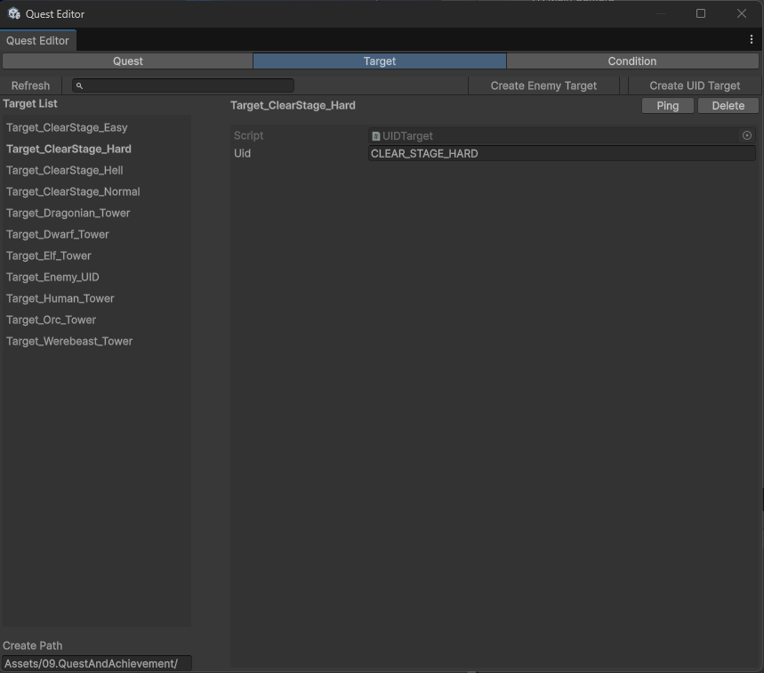 | 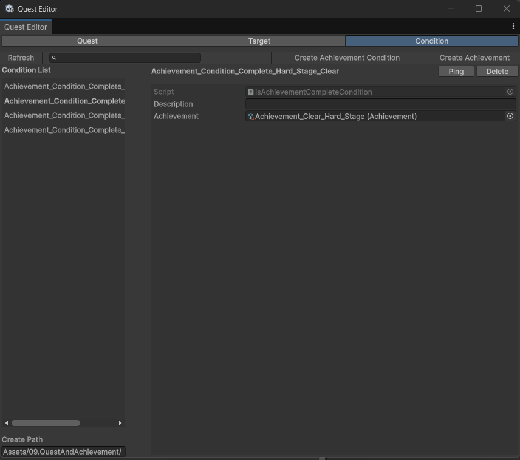 |

- **문제:** Tower, Enemy, Item, Wave, Quest 데이터를 직접 편집하면 UID, enum, 참조, 수치 입력을 반복해서 확인해야 했다.
- **설계:** JSON과 ScriptableObject 데이터를 Unity Editor 안에서 제작·검증하도록 `EditorWindow`, `Validate` 탭, `Custom Inspector`, Play Mode Debugger, `ConditionalFieldDrawer`를 구성했다.
- **이점:** UID 중복, enum 오류, 누락 참조, 잘못된 수치 입력을 줄이고 데이터 편집·에셋 생성·테스트 입력을 하나의 제작·검증 흐름에서 수행할 수 있다.
- **주요 클래스 흐름:** **EditorWindow / CustomEditor / CustomPropertyDrawer → JSON / ScriptableObject / Runtime Debug Target**
- **상세 문서:** [EditorTooling](Docs/Systems/EditorTooling.md)

## Technical Highlights

- **JSON-based Data-driven Content:** Tower, Enemy, Item, Wave, Meta 데이터를 JSON으로 관리
- **C# event 기반 흐름:** 전투, UI, 퀘스트, 세션의 주요 상태 변경을 이벤트로 전달
- **Runtime / Persistent Data Separation:** 런 강화와 계정 단위 메타 성장 분리
- **Save Access Separation:** Firebase Firestore 접근과 저장 흐름 분리, 로드 결과 상태 구분
- **Presenter / View Separation:** 표시 값 변환과 Unity UI 조작 책임 분리
- **Editor Tooling:** 데이터 제작·검증, Custom Inspector, Play Mode 디버깅 도구

## Problem Solving

Key Features 전반에서 반복된 설계 판단은 세 가지다.

- **부분 성공 상태 관리:** 결제, 대기열 저장, GameObject 생성, 필드 등록을 각각 확인하고 성공한 단계에 맞춰 환불·유지·제거를 결정했다.
- **복합 완료 조건:** 웨이브는 단일 이벤트가 아니라 스폰 상태와 생존 적 수의 현재값을 함께 검사한다.
- **외부 데이터 실패 구분:** Firebase Firestore 결과와 저장 모델 검증을 분리해 신규 사용자 초기화와 실제 오류 대응의 경계를 정했다.

자세한 문제 정의, 선택한 전략, 처리 순서는 [Case Study](Docs/Portfolio/CaseStudy.md)에서 확인할 수 있다.

## Tech Stack

| 기술 | 사용 목적 |
|---|---|
| Unity 6 | 2D 게임 클라이언트와 Unity Editor 확장 구현 |
| C# | 게임 로직, UI, 저장 흐름, Editor Tooling |
| Firebase Authentication / Firestore | 사용자 인증과 계정 진행 데이터 저장 |
| JSON | 정적 게임 데이터와 로컬 옵션 저장 |
| Unity UI / TextMeshPro | 게임 UI, 입력 컴포넌트, 정보 패널 |
| DOTween | UI 이동과 패널 전환 Sequence |
| ScriptableObject | 퀘스트·업적 원본 데이터 |
| Unity Editor Extension | 데이터 제작, 검증, Custom Inspector와 디버깅 도구 |

## Third-party Assets / Resources

| Asset / Resource | Source | Usage | License / Note |
|---|---|---|---|
| TODO | TODO | TODO | TODO: 라이선스 확인 필요 |

> 사용 에셋의 출처와 라이선스는 공개 전 정리할 예정이다.

## Documentation

### Portfolio

- [기술 문서 메인](Docs/README.md)
- [프로젝트 요약](Docs/Portfolio/ProjectSummary.md)
- [케이스 스터디](Docs/Portfolio/CaseStudy.md)
- [프로젝트 회고](Docs/Postmortem.md)

### Architecture

- [시스템 아키텍처](Docs/Architecture/SystemArchitecture.md)
- [이벤트 흐름](Docs/Architecture/EventFlow.md)
- [데이터 흐름](Docs/Architecture/DataFlow.md)

### Systems

- [그리드 및 경로 검증 시스템](Docs/Systems/GridPathValidationSystem.md)
- [타워 건설 시스템](Docs/Systems/BuildSystem.md)
- [상점 및 대기열 시스템](Docs/Systems/ShopAndQueueSystem.md)
- [웨이브 및 적 시스템](Docs/Systems/WaveAndEnemySystem.md)
- [메타 성장 시스템](Docs/Systems/MetaUpgradeSystem.md)
- [저장 및 불러오기 시스템](Docs/Systems/SaveLoadSystem.md)
- [퀘스트 및 업적 시스템](Docs/Systems/QuestSystem.md)
- [UI 정보 패널 시스템](Docs/Systems/UIInfoPanelSystem.md)
- [Editor Tooling](Docs/Systems/EditorTooling.md)

## Future Improvements

- Unity Profiler 기반 생성·파괴, 경로 탐색, 타겟 탐색 비용 측정
- 건설, 대기열 상태, 웨이브 종료, 저장 검증 규칙의 자동화 테스트 보강
- 저장 데이터 schemaVersion과 마이그레이션 정책 검토
- StageManager와 TowerController에 집중된 조정 책임 분리 검토

## Contact

- GitHub: [limrum09](https://github.com/limrum09)
- Portfolio Site: 준비 중
