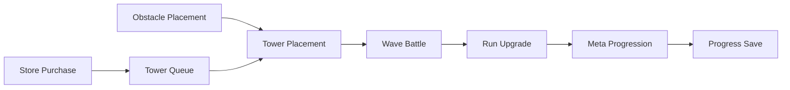

# RandomTowerDefence

> Unity 6 기반 2D 타워 디펜스 포트폴리오 프로젝트

플레이어가 그리드에 장애물을 설치해 타워 배치 기반을 만들고, 상점에서 구매한 타워를 대기열에 보관한 뒤 장애물 셀 위에 배치하는 게임입니다. 웨이브와 적 로스터는 JSON 데이터로 관리하며, 전투 중 적용되는 런 강화와 계정 단위 메타 성장을 분리했습니다. 기기별 옵션은 로컬 JSON으로, 계정 진행 데이터는 Firebase Firestore로 저장합니다. 주요 기능 구현을 마치고 시스템 구조와 문제 해결 과정을 기술 문서로 정리했습니다.

## Preview

핵심 플레이 흐름을 빠르게 확인할 수 있도록 영상과 GIF, 주요 화면 이미지를 준비할 예정입니다. 현재 공개 자료의 준비 현황은 다음과 같습니다.

| 구분 | 내용 | 상태 |
|---|---|---|
| Gameplay Video | 30초 플레이 영상 | TODO |
| Build Flow GIF | 상점 → 대기열 → 타워 설치 | TODO |
| Wave Battle GIF | 웨이브 전투 흐름 | TODO |
| Meta Growth GIF | 메타 성장 UI | TODO |
| Screenshots | 주요 화면 스크린샷 | TODO |

<!-- 플레이 영상 또는 대표 GIF를 이 위치에 추가 -->

## Project Info

| 항목 | 내용 |
|---|---|
| 장르 | 2D Tower Defense |
| 엔진 | Unity 6 |
| 언어 | C# |
| 개발 인원 | 1인 개발 |
| 개발 기간 | 2026.04.13 ~ 2026.06.26 |
| 대상 플랫폼 | PC / Steam 배포 목표 |
| 개발 상태 | 주요 기능 구현 완료, 포트폴리오 문서화 진행 |

## My Role

1인 개발 기준으로 전체 구현을 담당했습니다.

- 전체 프로그래밍
- 시스템 설계
- UI 구현
- 데이터 구조 설계
- 저장·불러오기 구현
- Unity Editor Tooling 작성
- 기술 문서 작성

## Core Gameplay Flow

장애물 설치와 상점 구매·대기열 보관은 각각 타워 배치를 준비하는 흐름입니다. 두 조건이 갖춰지면 장애물 셀에 타워를 배치하고, 웨이브 전투에서 획득한 자원을 런 강화와 계정 메타 성장으로 연결합니다.

## Key Features

| 시스템 | 요약 | 상세 문서 |
|---|---|---|
| Tower Build System | 장애물 셀 위에 타워를 배치하고 생성·필드 점유·큐 상태를 순서대로 갱신 | [BuildSystem](Docs/Systems/BuildSystem.md) |
| Shop & Queue System | 구매와 배치 시점을 분리하고 타워 UID를 대기열에 보관 | [ShopAndQueueSystem](Docs/Systems/ShopAndQueueSystem.md) |
| Wave & Enemy System | JSON 웨이브 로스터 검증, 적 생성·이동, 생존 적 집계와 종료 판정 | [WaveAndEnemySystem](Docs/Systems/WaveAndEnemySystem.md) |
| Meta Upgrade System | 기본 스탯, 런 강화, 계정 메타 성장을 분리해 최종 능력치 계산 | [MetaUpgradeSystem](Docs/Systems/MetaUpgradeSystem.md) |
| Save & Load System | 로컬 JSON과 Firebase Firestore의 저장 대상을 분리하고 실패 상태를 구분 | [SaveLoadSystem](Docs/Systems/SaveLoadSystem.md) |
| Quest & Achievement System | ScriptableObject 원본과 런타임 진행 상태를 분리해 퀘스트·업적 관리 | [QuestSystem](Docs/Systems/QuestSystem.md) |
| UI Info Panel System | Presenter/View 기반 정보 표시와 패널 전환 상태 관리 | [UIInfoPanelSystem](Docs/Systems/UIInfoPanelSystem.md) |
| Editor Tooling | 데이터 제작·검증과 Play Mode 디버깅을 위한 Unity Editor 확장 | [EditorTooling](Docs/Systems/EditorTooling.md) |

## Technical Highlights

- **Data-Driven Design:** Tower, Enemy, Item, Wave, Meta 데이터를 JSON으로 관리
- **Event-Driven Flow:** 전투, UI, 퀘스트, 세션 상태를 C# 이벤트로 연결
- **Runtime / Persistent Data Separation:** 스테이지 런 상태와 계정 진행 데이터를 분리
- **Firebase Save Pipeline:** Firestore 로드 결과를 문서 없음, 네트워크, 권한, 시간 초과, 데이터 손상 상태로 구분
- **Presenter / View Structure:** 표시 값 변환과 Unity UI 조작 책임을 분리
- **Editor Tooling:** 데이터 테이블, 퀘스트 에셋, Inspector, Play Mode 디버깅 작업을 Editor 확장으로 보조

## Problem Solving

### 1. 큐 기반 구매 흐름과 타워 배치 검증

**Problem**

상점에서 타워를 구매하면 타워가 즉시 그리드에 생성되는 것이 아니라, 먼저 대기열에 저장됩니다. 구매 자체는 골드와 대기열 빈 공간을 확인하면 처리할 수 있었지만, 이후 대기열에 저장된 타워를 실제 필드에 배치하는 과정에서 더 까다로운 검증이 필요했습니다. 타워는 아무 셀에나 설치될 수 없고, 플레이어가 설치한 장애물 셀 위에만 배치되어야 하며, 기존 타워 점유 상태와 선택된 큐 슬롯 상태도 함께 확인해야 했습니다.

**Solution**

상점은 구매 가능 여부와 대기열 공간만 확인하고, 구매 성공 시 타워 UID를 큐에 저장하도록 역할을 제한했습니다. 실제 타워 배치는 TowerController와 FieldTowerManager에서 처리하며, 선택된 셀의 장애물 존재 여부, 기존 타워 점유 여부, 선택된 타워 UID, 필드 등록 가능 여부를 순서대로 검증했습니다.

**Result**

대기열에 빈 공간이 없으면 구매가 발생하지 않고, 배치 검증에 실패하면 큐 상태를 유지합니다. 장애물 셀 위에 정상적으로 타워가 배치되고 필드 등록이 성공한 경우에만 설치 완료 이벤트를 통해 큐에서 해당 타워를 제거하도록 흐름을 정리했습니다.

### 2. 웨이브 종료 조건 처리

**Problem**

적 스폰 종료와 필드의 생존 적 수가 0이 되는 시점은 서로 다르게 발생합니다.

**Solution**

isSpawning과 aliveEnemyCnt를 별도로 관리하고 스폰 종료, 적 사망, 적 도착 시 같은 완료 조건을 다시 검사했습니다.

**Result**

스폰이 끝나고 생존 적이 0명인 경우에만 다음 웨이브 또는 스테이지 종료 흐름으로 이동합니다.

### 3. 저장 실패와 데이터 검증

**Problem**

Firestore 문서 없음, 네트워크 오류, 권한 오류, 시간 초과, 데이터 손상을 구분해야 했습니다.

**Solution**

Firestore 로드 결과를 Success, DocumentMissing, NetworkError, PermissionError, Timeout, DataCorrupted 등의 상태로 나누고 IValidSaveData 검증을 적용했습니다.

**Result**

신규 사용자 기본 데이터 생성과 실제 로드 실패 처리를 분리하고, dirty flag로 변경된 저장 영역만 기록합니다.

> 자세한 문제 정의와 클래스·이벤트 흐름은 [Case Study](Docs/Portfolio/CaseStudy.md)에서 확인할 수 있습니다.

## Editor Tools

반복적인 데이터 입력과 테스트를 Unity Editor 안에서 처리할 수 있도록 제작 도구를 구성했습니다.

- Tower / Enemy / Item / Wave JSON 데이터 테이블 에디터
- Quest / Achievement 및 Target / Condition 에셋 제작 도구
- 업적, 스테이지, 로비 진행 상태를 확인하는 Play Mode 디버깅 도구
- ConditionalFieldDrawer를 이용한 Inspector 필드 표시·활성 상태 제어
- 중복 UID, enum, 누락 참조, 잘못된 수치 등을 확인하는 데이터 검증 탭

상세 도구와 실제 파일 위치는 [Editor Tooling](Docs/Systems/EditorTooling.md)에 정리했습니다.

## Tech Stack

| 기술 | 사용 목적 |
|---|---|
| Unity 6 | 2D 게임 클라이언트와 Unity Editor 확장 구현 |
| C# | 게임 로직, UI, 저장 흐름, Editor Tooling |
| Firebase Authentication / Firestore | 사용자 인증과 계정 진행 데이터 저장 |
| JSON | 정적 게임 데이터와 로컬 옵션 저장 |
| Unity UI / TextMeshPro | 게임 UI, 입력 컴포넌트, 정보 패널 |
| DOTween | UI 이동과 패널 전환 Sequence |
| ScriptableObject | 퀘스트·업적 원본 데이터 |
| Unity Editor Extension | 데이터 제작, 검증, Custom Inspector와 디버깅 도구 |

## Documentation

### Portfolio

- [기술 문서 메인](Docs/README.md)
- [프로젝트 요약](Docs/Portfolio/ProjectSummary.md)
- [케이스 스터디](Docs/Portfolio/CaseStudy.md)
- [면접 예상 질문](Docs/Portfolio/InterviewQA.md)
- [프로젝트 회고](Docs/Postmortem.md)

### Architecture

- [시스템 아키텍처](Docs/Architecture/SystemArchitecture.md)
- [이벤트 흐름](Docs/Architecture/EventFlow.md)
- [데이터 흐름](Docs/Architecture/DataFlow.md)

### Systems

- [타워 건설 시스템](Docs/Systems/BuildSystem.md)
- [상점 및 대기열 시스템](Docs/Systems/ShopAndQueueSystem.md)
- [웨이브 및 적 시스템](Docs/Systems/WaveAndEnemySystem.md)
- [메타 성장 시스템](Docs/Systems/MetaUpgradeSystem.md)
- [저장 및 불러오기 시스템](Docs/Systems/SaveLoadSystem.md)
- [퀘스트 및 업적 시스템](Docs/Systems/QuestSystem.md)
- [UI 정보 패널 시스템](Docs/Systems/UIInfoPanelSystem.md)
- [Editor Tooling](Docs/Systems/EditorTooling.md)

## Current Limitations / Future Improvements

- 플레이 영상, GIF, 주요 화면 스크린샷 추가 필요
- Unity Profiler 기반 생성·파괴, 경로 탐색, 타겟 탐색 비용 측정
- 건설, 큐 상태, 웨이브 종료, 저장 검증 규칙의 자동화 테스트 보강
- 저장 데이터 schemaVersion과 마이그레이션 정책 검토
- StageManager와 TowerController에 집중된 조정 책임 분리 검토
- Editor Tool의 공통 편집 기반과 통합 검증 리포트 검토

## Contact

- GitHub: [limrum09](https://github.com/limrum09)
- Portfolio Site: TODO
